# 云原生的未来

注：本文是笔者于 2018 年 5 月 20 日在[第四届南京全球技术周](https://www.bagevent.com/event/1233659)上【互联网技术专场】上的题为【云原生应用的下一站】的演讲的部分内容的文字整理而成。

要想搞明云原生的未来，首先我们要弄明白云原生是什么。CNCF 最初给出的[定义](https://github.com/cncf/toc/blob/main/DEFINITION.md)是：

- 容器化
- 微服务
- 容器可以动态调度

我认为云原生实际上是一种理念或者说是方法论，它包括如下四个方面：

- 容器化：作为应用包装的载体
- 持续交付：利用容器的轻便的特性，构建持续集成和持续发布的流水线
- DevOps：开发与运维之间的协同，上升到一种文化的层次，能够让应用快速的部署和发布
- 微服务：这是应用开发的一种理念，将单体应用拆分为微服务才能更好的实现云原生，才能独立的部署、扩展和更新

一句话解释什么是云原生应用：云原生应用就是为了在云上运行而开发的应用。

## Kubernetes：云原生操作系统

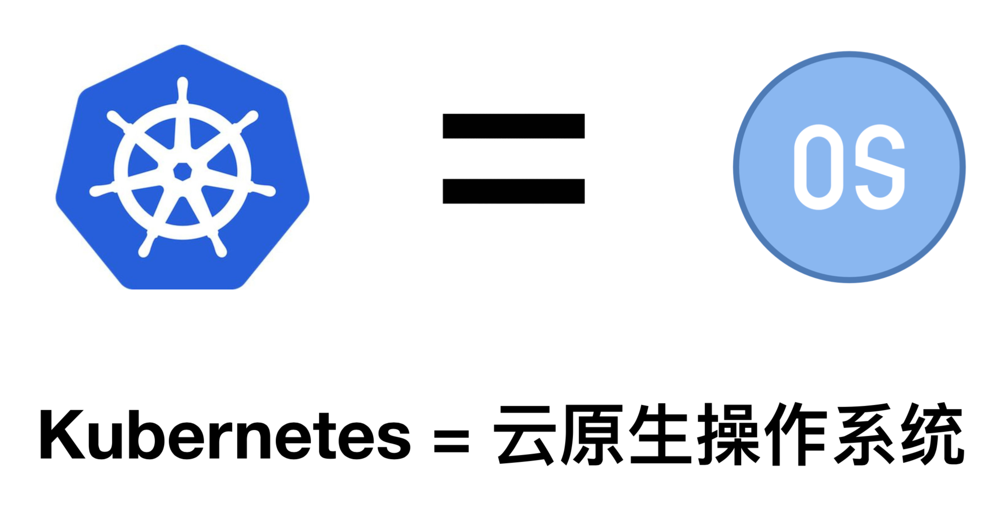

要运行这样的应用必须有一个操作系统，就像我们运行PC或手机应用一样，而Kubernetes就是一个这样的操作系统。

我们再来看下操作系统包括哪些层次。

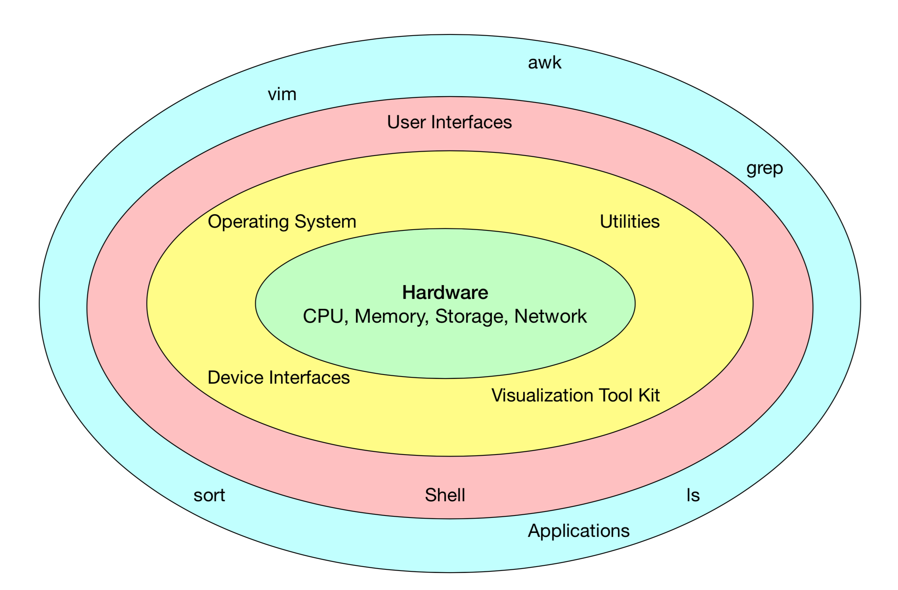

- 硬件管理：可以管理CPU、内存、网络和存储
- 设备接口、虚拟化工具、实用工具
- Shell、用户界面
- 各种终端工具，如awk、sort、grep、vim等

下面是CNCF给出的云原生景观图。

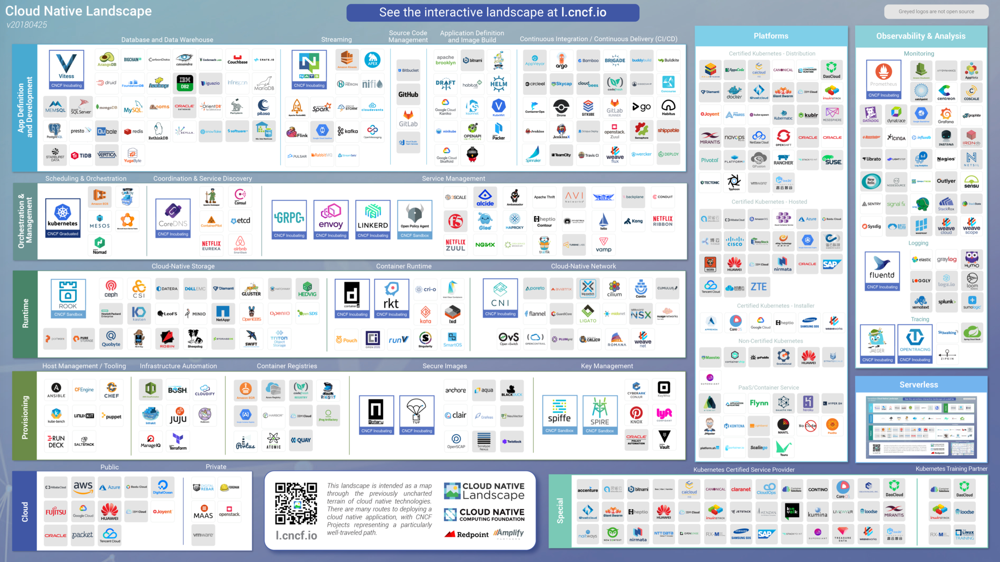

该图中包括云原生的各种层次的提供者和应用，通过该图可以组合出一些列的云原生平台。

- IaaS云提供商（公有云、私有云）
- 配置管理，提供最基础的集群配置
- 运行时，包括存储和容器运行时、网络等
- 调度和管理层，协同和服务发现、服务管理
- 应用层

也可以有平台提供以上所有功能，还可以有提供可观测性、分析和扩展应用。

看到这个景观图，大家觉得Kubernetes真的还只做了容器编排吗？实际上它是制定了一个标准。就像一个系统一样，所有的应用和插件都是基于它来构建的。

## Kubernetes的现状与未来

Kubernetes发展已经有3年多的时间了，它已经基本成为了容器编排调度框架的标准。它的各种抽象与资源定义已经被大家广为接受。其中最基础的调度单元Pod。

创建一个自定义资源类型需要满足的条件。

这是KubeVirt的架构图。

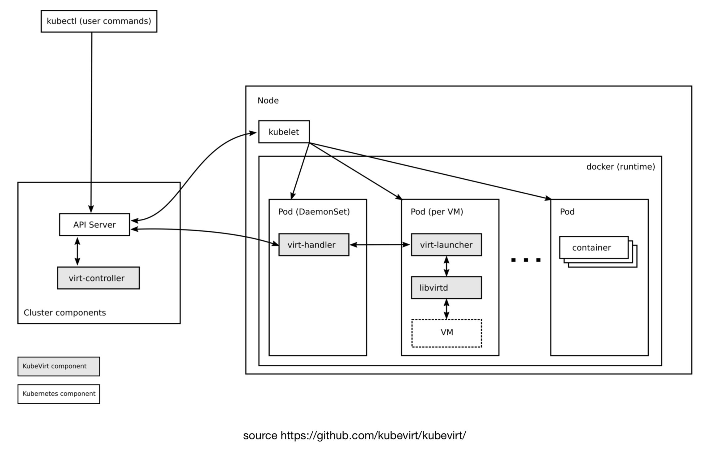

我们看到图中有两个是Kubernetes原生的组件，API server和kubelet，我们创建了virt-controller就是为了创建CRD的controller，它扩展了kube-controller的功能，用于管理虚拟机的生命周期，同时在每个节点上都用DaemonSet的方式运行一个virt-handler，这个handler是用于创建虚拟机的处理器，每个节点上即可用运行虚拟机也可以运行容器，只要这个节点上有virt-handler就可以运行和调度虚拟机。

### Kubernetes做了什么？

Kubernetes优秀的分布式架构设计，给我们提供了众多了可扩展接口，可以让我们很方便的扩展自己的运行时、网络和存储插件，同时还可以通过CRD管理我们自己的分布式应用。它的声明式配置方式可以让我们利用Kubernetes的原语快速的编排出一个云原生应用。

Kubernetes的资源隔离也能保证对集群资源的最大化和最优利用率。

下图中展示了Kubernetes中的资源隔离层次。

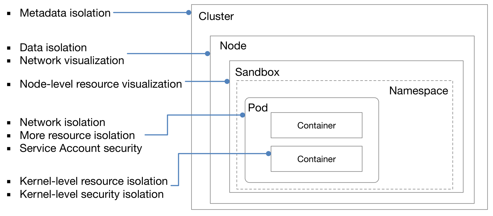

- 容器
- Pod：命名空间的隔离，共享网络，每个Pod都有独立IP，使用Service Account为Pod赋予账户
- Sandbox：是对最小资源调度单位的抽象，甚至可以是虚拟机
- Node：网络隔离，每个节点间网络是隔离的，每个节点都有单独的IP地址
- Cluster：元数据的隔离，使用Federation可以将不同的集群联合在一起

Kubernetes中的基本资源类型分成了三类：

- 部署：Deploymnt、ReplicaSet、StatefulSet、DaemonSet、Job、CronJob
- 服务：Service、Ingress
- 存储：PV、PVC、ConfigMap、Secret

在最近一届的KubeCon & CloudNativeCon上Operator已经变得越来越流行。下面是OpenEBS的一个使用Operator的例子。

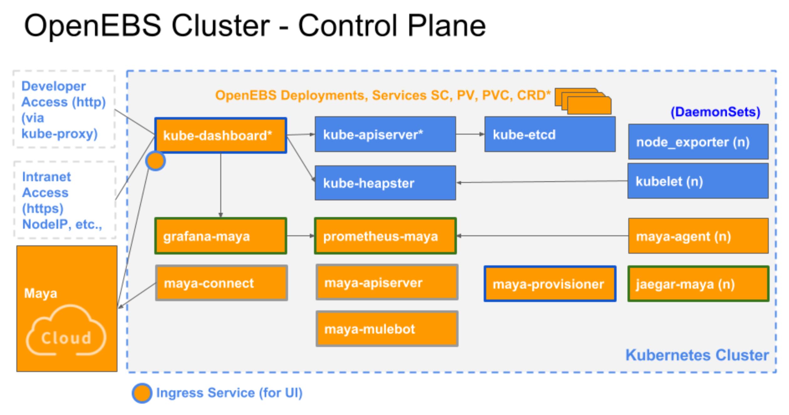

OpenEBS是一款容器化存储，它基于Ceph构建，容器化存储最大的好处就是复用Kubernetes的资源类型，简化存储应用的部署，将单体的存储拆分为“微服务化”的存储，即每个应用在声明PV的时候才会创建存储，并与PV的生命周期一样都是独立于应用的。

OpenEBS的存储也是分控制平面和数据平面的，下图是OpenEBS的架构图。

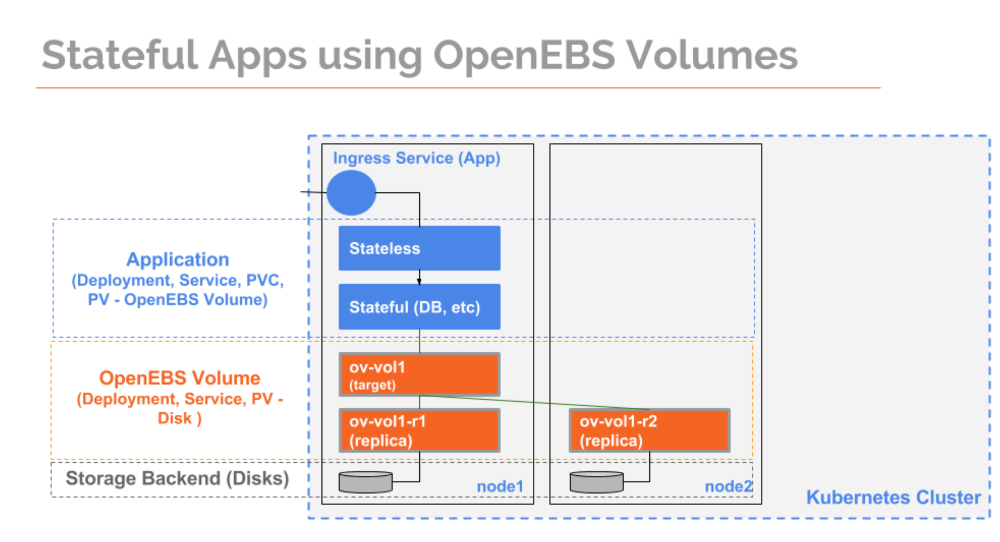

黄色部分是OpenEBS的组件（除了kube-dashboard），它是使用Kubernetes的各种原语和CRD来创建的，架构跟Kubernetes本身也很类似。

用户在使用OpenEBS的StorageClass创建PV的时候，OpenEBS会为每个PV创建一个用户管理该PV的Deployment，这个Deployment再来创建存储副本，每个PV的存储副本都可以不同，这取决的用户如何定义的StorageClass。这样就可以将原来的单体存储拆分为微服务化的存储。

上面说到了Operator的一个应用，下面再来看一个我们之前在Kubernetes中部署Hadoop YARN和Spark的例子。

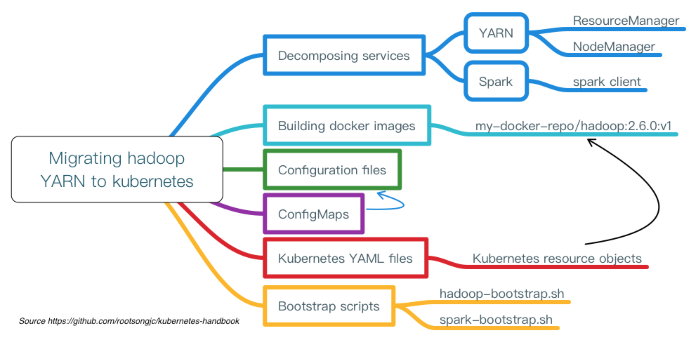

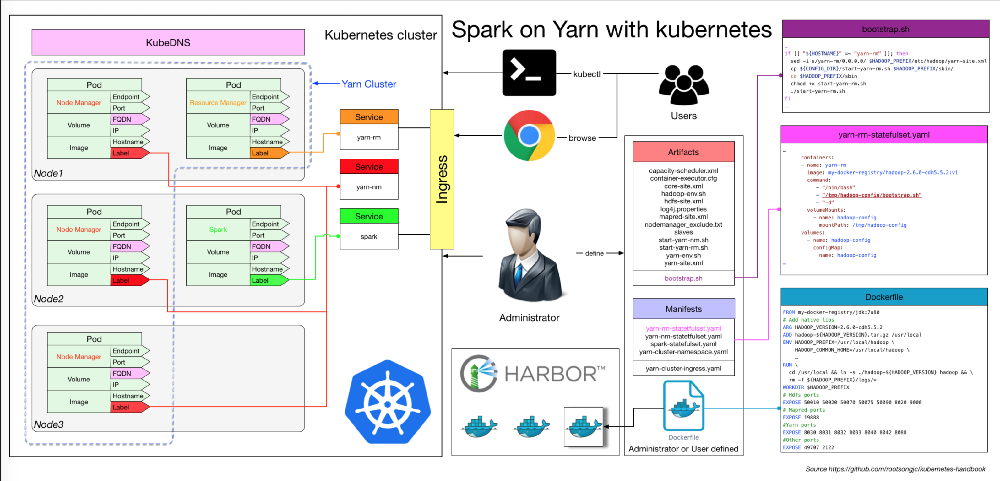

Kubernetes始于12因素应用的PaaS平台，它是微服务的绝佳部署管理平台，基于它可以应用多种设计模式。它的未来将变成什么样呢？

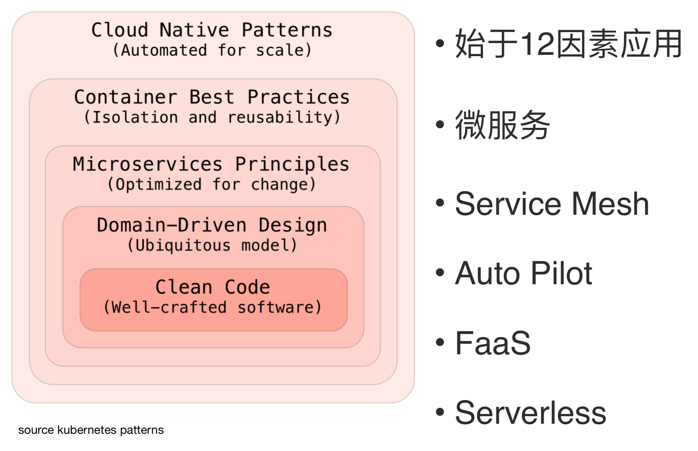

- Service Mesh：解决微服务治理问题
- Auto Pilot：自动驾驭能力，服务自动扩展，智能运维
- FaaS/Serverless：用户无需再关注底层平台，只需要部署服务，根据服务的资源消耗和使用时间付费

**Serverless的发展**

为了实现上述的各种能力，急需解决的就是基于Kubernetes的持续集成和发布问题。

当前出现了一系列的基于Kubernetes的CI/CD工具，如Jenkins-x、Gitkube，它提供了从代码提交、自动编译、打包镜像、配置注入、发布部署到Kubernetes平台的一系列自动化流程。

甚至出现了像ballerina这样的云原生编程语言，它的出现就是为了解决应用开发到服务集成之间的鸿沟的。它有以下几个特点。

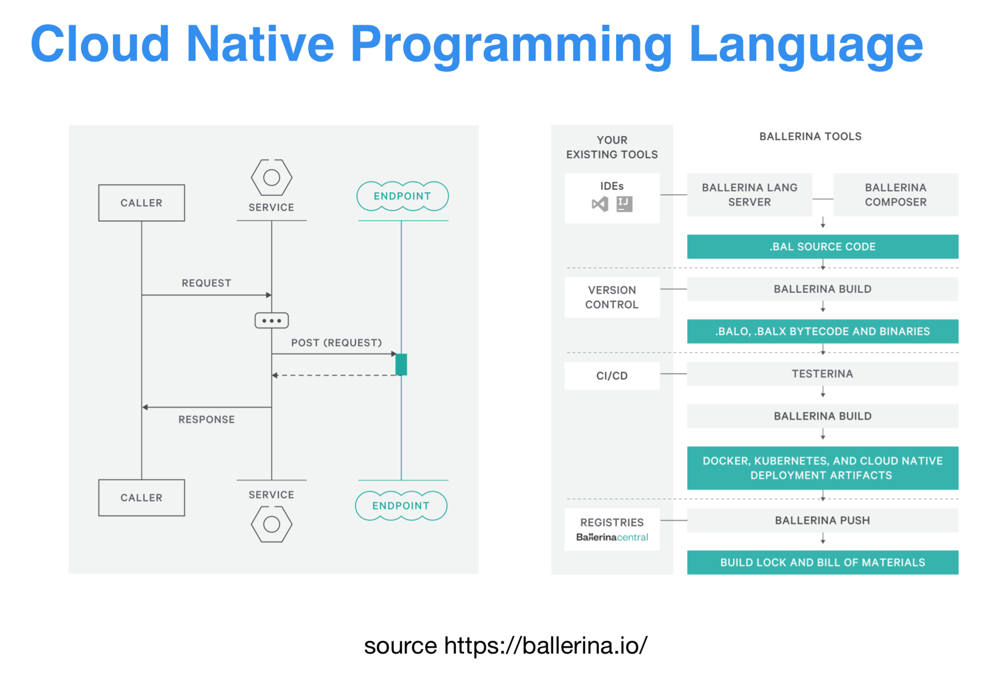

- 使用云原生语义的DSL
- 注解式配置
- 序列图式操作
- 支持微服务的治理

要完成云的集成CI/CD，或者用一个词代替来说就是GitOps的需求越来越强烈。

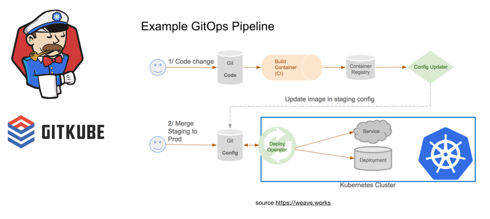

### Kubernetes没有做什么

看下这张图中的两个服务，它们使用的是kube-proxy里基于iptables的原生的负载均衡，并且服务间的流量也没有任何控制。

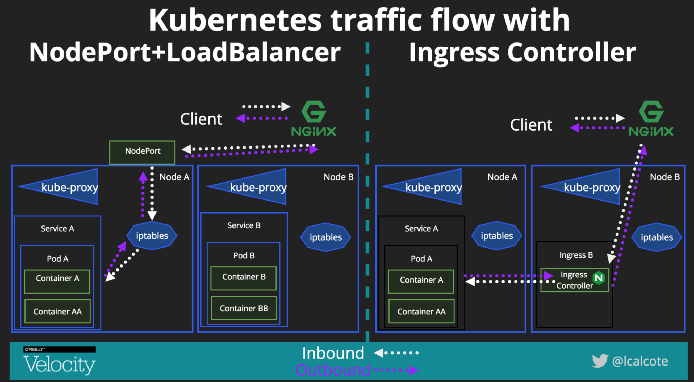

Kubernetes缺少的最重要的一个功能就是微服务的治理，微服务比起单体服务来说使得部署和运维起来更加复杂，对于微服务的可观测性也有更高的要求，同时CI/CD流程Kubernetes本身也没有提供。

## Service Mesh

Service Mesh是一个专用的基础设施层，它能够将微服务的治理层应用层下沉到基础设施层，将原来开发人员很多活给分担出去，让开发人员更注重业务逻辑和应用的性能本身，将服务治理的能力交给平台来解决。使用Service Mesh能够提供安全的服务间通讯、在服务间通讯应用各种策略实现灰度发布、流量切分等功能，它还能适配多语言，让微服务应用无感知的迁移到云原生。

这是Istio在Kubenetes中创建的各种CRD，这些CRD有些是作为路由策略、有些是做监控指标和权限控制的。

这是Istio Service Mesh的架构图。

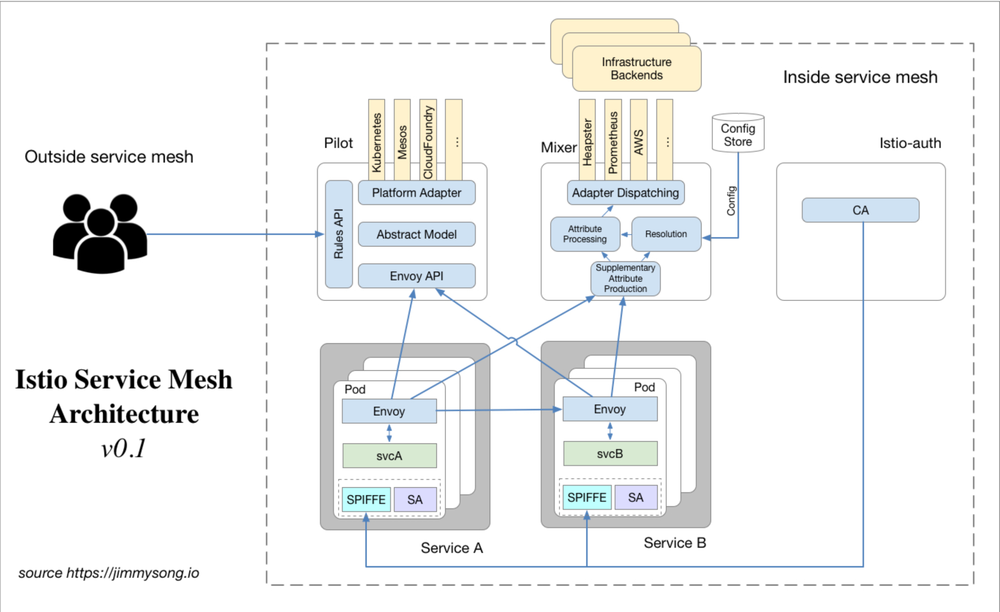

- Pilot：提供用户接口，用户可以通过该接口配置各种路由规则，Pilot还可以通过适配器获取平台上各种服务之间的管理，Evnoy这个使用Sidecar方式部署到每个应用pod中的进程会通过Pilot中的Envoy API获得平台上各个服务之间的管理，同时也会应用用户配置的路由规则。
- Mixer：获取各种平台属性，服务间通讯时会先访问Mixer兼容各平台的属性信息，如quota、访问控制和策略评估，将服务间的访问信息记录后上报到mixer形成遥测报告。
- 每个Pod上还有SA和SPIFFE做权限管控。

Service Mesh实际上为了解决社会分工问题，它本身是为了解决微服务的治理。

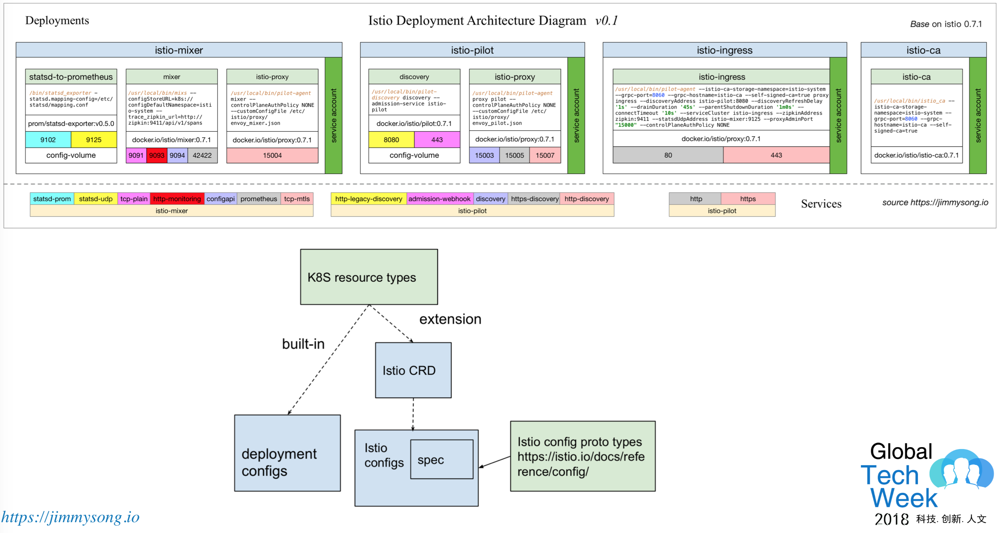

Pilot和控制平面是为了运维人员准备的。

数据平面是为开发人员准备的。

Isito在每个上下游服务之间部署一个Envoy，Envoy中有几个基本的服务发现服务，监听器即Envoy要转发的流量端口，Endpoint是要转发的目的地，Cluster是一系列Endpoint用来做负载均衡，Route是定义各种路由规则，每个Envoy进程里可以设置多个Listener。

## 总结

云原生是在云计算发展到一定阶段的产物，它的方兴未艾，未来我们会看到更多优秀的云原生技术的出现。
