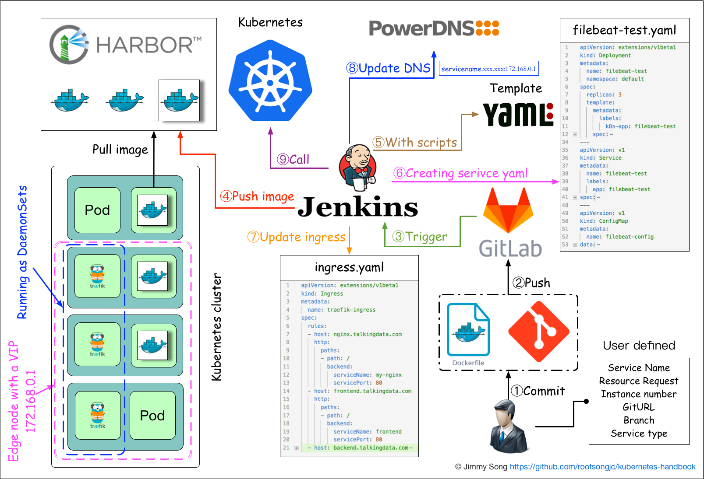

# 使用 Jenkins 进行持续集成与发布

我们基于 Jenkins 的 CI/CD 流程如下所示。

## 流程说明

应用构建和发布流程说明。

1. 用户向 Gitlab 提交代码，代码中必须包含 `Dockerfile`
2. 将代码提交到远程仓库
3. 用户在发布应用时需要填写 git 仓库地址和分支、服务类型、服务名称、资源数量、实例个数，确定后触发 Jenkins 自动构建
4. Jenkins 的 CI 流水线自动编译代码并打包成 docker 镜像推送到 Harbor 镜像仓库
5. Jenkins 的 CI 流水线中包括了自定义脚本，根据我们已准备好的 kubernetes 的 YAML 模板，将其中的变量替换成用户输入的选项
6. 生成应用的 Kubernetes YAML 配置文件
7. 更新 Ingress 的配置，根据新部署的应用的名称，在 ingress 的配置文件中增加一条路由信息
8. 更新 PowerDNS，向其中插入一条 DNS 记录，IP 地址是边缘节点的 IP 地址。关于边缘节点，请查看 [边缘节点配置](edge-node-configuration.md)
9. Jenkins 调用 kubernetes 的 API，部署应用