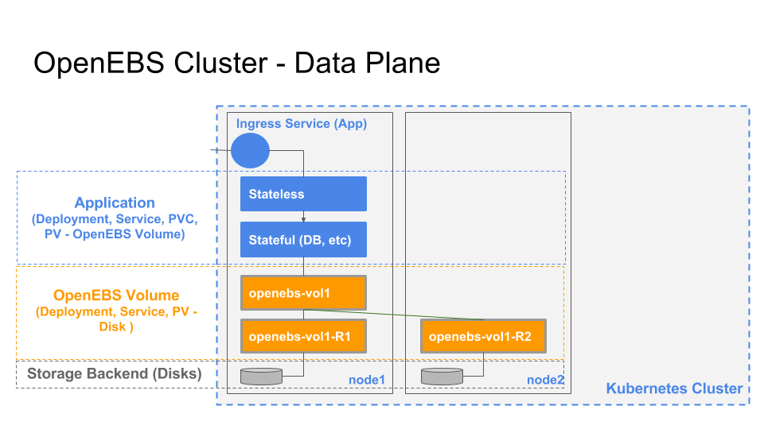
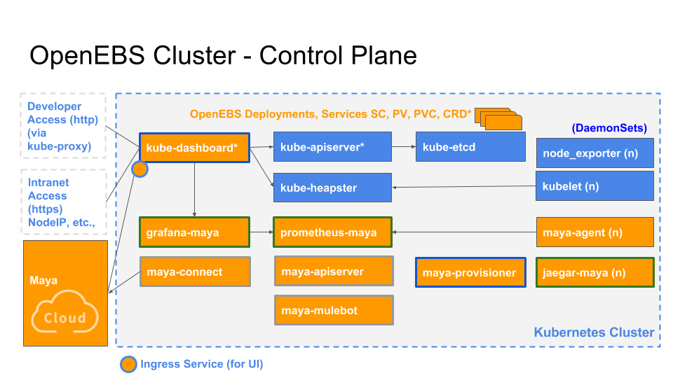

# OpenEBS

[OpenEBS](https://github.com/openebs/openebs) 是一款使用 Go 语言编写的基于容器的块存储开源软件。OpenEBS 使得在容器中运行关键性任务和需要数据持久化的负载变得更可靠。

OpenEBS 由 CloudByte 研发，这是一家专业做容器化存储的公司，OpenEBS 是其一款开源产品，CloudByte 将其在企业级容器存储的经验付诸到该项目中。这个项目的愿景也很简单，就是让需要持久化存储的工作负载中的存储服务能够直接集成在环境中，存储服务可以自动管理，将存储的细节隐藏起来，就像存储系统是另一套基础架构一样。

我们知道 AWS 中提供了 [EBS](https://amazonaws-china.com/cn/ebs/)（Elastic Block Storage），适用于 Amazon EC2 的持久性块存储，可以满足要求最苛刻的应用程序在功能和性能方面的要求，OpenEBS 即其开源实现。

## 简介

使用 OpenEBS，你可以将有持久化数据的容器，像对待其他普通容器一样来对待。OpenEBS 本身也是通过容器来部署的，支持 Kubernetes、Swarm、Mesos、Rancher 编排调度，存储服务可以分派给每个 pod、应用程序、集群或者容器级别，包括：

- 跨节点的数据持久化
- 跨可用区和云厂商的数据同步
- 使用商业硬件和容器引擎来提供高可扩展的块存储
- 与容器编排引擎集成，开发者的应用程序可以自动的配置 OpenEBS
- 基于 CloudByte 在 BSD 的容器化经验，为用户提供 OpenEBS 的 QoS 保证

## 架构

OpenEBS 存储控制器本身就运行在容器中。OpenEBS Volume 由一个或多个以微服务方式运行的容器组成。这种存储控制器功能基于微服务架构 —— 每个卷的数据由其自己的一组容器来提供，而不是由一个统一的同时为多个卷提供控制的，单体（monolithic）存储控制器来提供。这就是 OpenEBS 与传统存储设备的本质区别。

OpenEBS 的架构可以分为数据平面（Data Plane）和控制平面（Control Plane）两部分：

- 数据平面：为应用程序提供数据存储
- 控制平面：管理 OpenEBS 卷容器，这通常会用到容器编排软件的功能

### 数据平面

下图是 OpenEBS 对应在 Kubernetes 集群上部署的架构图。其中，黄色部分是 OpenEBS 持久化存储卷，通过 Kubernetes 的 PV 来创建，使用 iSCSI 来实现，数据保存在 node 节点上或者云中的卷（如 EBS、GPD 等），这取决于您的集群部署在哪里。OpenEBS 的卷完全独立于用户的应用的生命周期来管理，这也是 Kuberentes 中的 PV 的基本思路。

OpenEBS 卷为容器提供持久化存储，具有针对系统故障的弹性，更快地访问存储，快照和备份功能。此外，它还提供了监控使用情况和执行 QoS 策略的机制。

存储数据的磁盘称为存储后端，可以是主机目录，附加块设备或远程磁盘。每个 OpenEBS 卷包含一个 iSCSI 目标容器（在上图中表示为 openebs-vol1）和一个或多个副本容器（openebs-vol1-R1 和 openebs-vol1-R2）。

应用程序 pod 通过 iSCSI 目标容器访问存储，iSCSI 目标容器将数据复制到其所有副本。在发生节点故障时，iSCSI 目标容器将从剩余的其中一个在线节点上启动，并通过连接到可用副本容器来提供数据。

**源码**

该部分的实现包括两个容器：

- [openebs/jiva](https://github.com/openebs/jiva)：存储控制功能，包括复制逻辑
- [openebs/gotgt](https://github.com/openebs/gotgt)：由 openebs/jiva 使用的 iSCSI 目标功能

### 控制平面

OpenEBS 控制平面又叫做存储编排或 maya。目的是为了创建超融合的 OpenEBS，将其挂载到如 Kubernetes、Swarm、Nomad 等容器编排调度引擎上，用来扩展特定的容器编排系统提供的存储功能。

OpenEBS 的控制平面也是基于微服务的，它的服务可以分成以下几个部分：

- 容器编排插件，用于增加强容器编排框架的功能：
  - **Kubernetes 动态配置 **：[openebs-provisioner](https://github.com/openebs/external-storage/tree/master/openebs)
  - **Kubernetes-dashboard**：[openebs-dashboard](https://github.com/openebs/dashboard)
  - **扩展的 schema**：基于 Kubernetes 的 CRD（自定义资源类型），存储 OpenEBS 相关的配置数据
- 集群服务，提供 OpenEBS 特定的存储智能，如：
  - **maya-apiserver**：包含执行卷操作的 API，可将请求转换为容器编排系统特定的操作
  - **maya-mulebot**：使用收集的信息来建议优化的布局和事件处理提示
  - **maya-connect**：允许将监控数据上传到 `maya-cloud`，以便进一步进行存储访问模式分析
- 节点服务，提供 OpenEBS 特定的随 kubelet 一起运行的存储智能，如：
  - **maya-agent**：包括存储管理功能

通过使用 Prometheus、Heapster、Grafana 和 Jaegar 进行上述服务，可以添加监控和跟踪功能。

**源码**

- [openebs/maya](https://github.com/openebs/maya)：所有特定的二进制代码（非插件）都存储在这个仓库中，比如 `maya-apiserver`、`maya-agent`、`maya-mulebot`、`maya-connect`、`mayactl` 等等。
- [openebs-dashboard](https://github.com/openebs/dashboard)：kubernetes-dashboard 项目的分支，扩展了存储功能。
- [openebs-provisioner](https://github.com/openebs/external-storage/tree/master/openebs)：来自 Kubernetes 孵化器项目的 OpenEBS Kubernetes Provisioner。

## 参考

- [OpenEBS 官网 - openebs.io](https://www.openebs.io/)
- [Data Scientists adopting tools and solutions that allow them to focus more on Data Science and less on the infrastructure around them - blog.openebs.io](https://blog.openebs.io/data-scientists-adopting-tools-and-solutions-that-allow-them-to-focus-more-on-data-science-and-less-db9654063bd5)