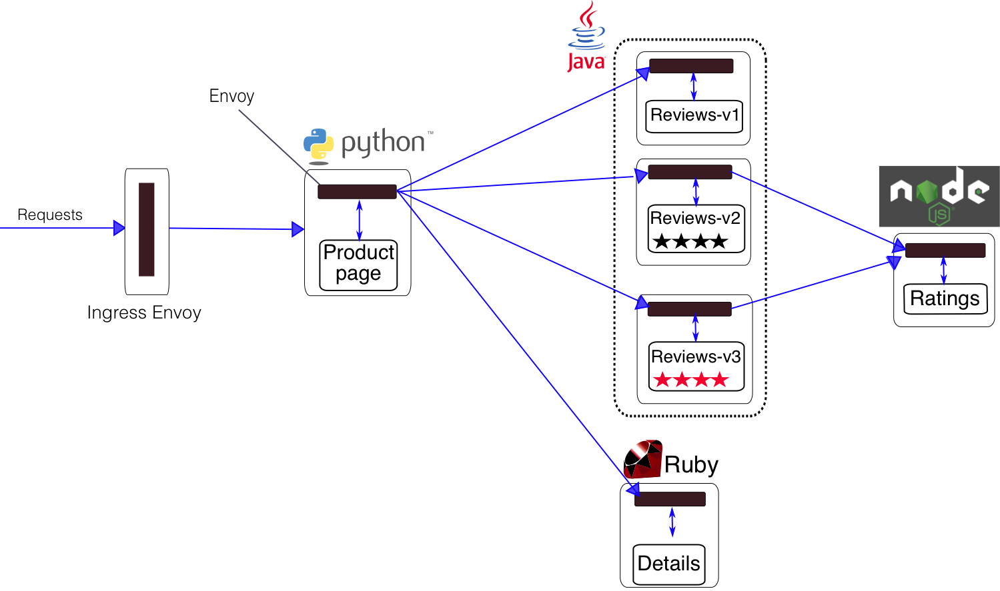

# Istio 中的流量路由过程详解

本文以 Istio 官方的 bookinfo 示例来讲解在进入 Pod 的流量被 iptables 转交给 Envoy sidecar 后，Envoy 是如何做路由转发的，详述了 Inbound 和 Outbound 处理过程。

下面是 Istio 官方提供的 bookinfo 的请求流程图，假设 bookinfo 应用的所有服务中没有配置 DestinationRule。



我们将要解析的是 `reviews-v1` 这个 Pod 中的 Inbound 和 Outbound 流量。

### 理解 Inbound Handler

Inbound Handler 的作用是将 iptables 拦截到的 downstream 的流量转发给 Pod 内的应用程序容器。在我们的实例中，假设其中一个 Pod 的名字是 `reviews-v1-545db77b95-jkgv2`，运行 `istioctl proxy-config listener reviews-v1-545db77b95-jkgv2 --port 15006` 查看该 Pod 中 15006 端口上的监听器情况 ，你将看到下面的输出。

```ini
ADDRESS PORT  MATCH                                                                                           DESTINATION
0.0.0.0 15006 Addr: *:15006                                                                                   Non-HTTP/Non-TCP
0.0.0.0 15006 Trans: tls; App: istio-http/1.0,istio-http/1.1,istio-h2; Addr: 0.0.0.0/0                        InboundPassthroughClusterIpv4
0.0.0.0 15006 Trans: raw_buffer; App: http/1.1,h2c; Addr: 0.0.0.0/0                                           InboundPassthroughClusterIpv4
0.0.0.0 15006 Trans: tls; App: TCP TLS; Addr: 0.0.0.0/0                                                       InboundPassthroughClusterIpv4
0.0.0.0 15006 Trans: raw_buffer; Addr: 0.0.0.0/0                                                              InboundPassthroughClusterIpv4
0.0.0.0 15006 Trans: tls; Addr: 0.0.0.0/0                                                                     InboundPassthroughClusterIpv4
0.0.0.0 15006 Trans: tls; App: istio,istio-peer-exchange,istio-http/1.0,istio-http/1.1,istio-h2; Addr: *:9080 Cluster: inbound|9080||
0.0.0.0 15006 Trans: raw_buffer; Addr: *:9080                                                                 Cluster: inbound|9080||
```

下面列出了以上输出中各字段的含义：

- ADDRESS：下游地址
- PORT：Envoy 监听器监听的端口
- MATCH：请求使用的传输协议或匹配的下游地址
- DESTINATION：路由目的地

`reviews` Pod 中的 Iptables 将入站流量劫持到 15006 端口上，从上面的输出我们可以看到 Envoy 的 Inbound Handler 在 15006 端口上监听，对目的地为任何 IP 的 9080 端口的请求将路由到 `inbound|9080||` Cluster 上。

从该 Pod 的 Listener 列表的最后两行中可以看到，`0.0.0.0:15006/TCP` 的 Listener（其实际名字是 `virtualInbound`）监听所有的 Inbound 流量，其中包含了匹配规则，来自任意 IP 的对 `9080` 端口的访问流量，将会路由到 `inbound|9080||` Cluster，如果你想以 Json 格式查看该 Listener 的详细配置，可以执行 `istioctl proxy-config listeners reviews-v1-545db77b95-jkgv2 --port 15006 -o json` 命令，你将获得类似下面的输出。

```json
[
    /*省略部分内容*/
    {
        "name": "virtualInbound",
        "address": {
            "socketAddress": {
                "address": "0.0.0.0",
                "portValue": 15006
            }
        },
        "filterChains": [
            /*省略部分内容*/
            {
                "filterChainMatch": {
                    "destinationPort": 9080,
                    "transportProtocol": "tls",
                    "applicationProtocols": [
                        "istio",
                        "istio-peer-exchange",
                        "istio-http/1.0",
                        "istio-http/1.1",
                        "istio-h2"
                    ]
                },
                "filters": [
                    /*省略部分内容*/
                    {
                        "name": "envoy.filters.network.http_connection_manager",
                        "typedConfig": {
                            "@type": "type.googleapis.com/envoy.extensions.filters.network.http_connection_manager.v3.HttpConnectionManager",
                            "statPrefix": "inbound_0.0.0.0_9080",
                            "routeConfig": {
                                "name": "inbound|9080||",
                                "virtualHosts": [
                                    {
                                        "name": "inbound|http|9080",
                                        "domains": [
                                            "*"
                                        ],
                                        "routes": [
                                            {
                                                "name": "default",
                                                "match": {
                                                    "prefix": "/"
                                                },
                                                "route": {
                                                    "cluster": "inbound|9080||",
                                                    "timeout": "0s",
                                                    "maxStreamDuration": {
                                                        "maxStreamDuration": "0s",
                                                        "grpcTimeoutHeaderMax": "0s"
                                                    }
                                                },
                                                "decorator": {
                                                    "operation": "reviews.default.svc.cluster.local:9080/*"
                                                }
                                            }
                                        ]
                                    }
                                ],
                                "validateClusters": false
                            },
                            /*省略部分内容*/
                        }
                    }
                ],
            /*省略部分内容*/
        ],
        "listenerFilters": [
        /*省略部分内容*/
        ],
        "listenerFiltersTimeout": "0s",
        "continueOnListenerFiltersTimeout": true,
        "trafficDirection": "INBOUND"
    }
]
```

既然 Inbound Handler 的流量中将来自任意地址的对该 Pod `9080` 端口的流量路由到 `inbound|9080||` Cluster，那么我们运行 `istioctl pc cluster reviews-v1-545db77b95-jkgv2 --port 9080 --direction inbound -o json` 查看下该 Cluster 配置，你将获得类似下面的输出。

```json
[
    {
        "name": "inbound|9080||",
        "type": "ORIGINAL_DST",
        "connectTimeout": "10s",
        "lbPolicy": "CLUSTER_PROVIDED",
        "circuitBreakers": {
            "thresholds": [
                {
                    "maxConnections": 4294967295,
                    "maxPendingRequests": 4294967295,
                    "maxRequests": 4294967295,
                    "maxRetries": 4294967295,
                    "trackRemaining": true
                }
            ]
        },
        "cleanupInterval": "60s",
        "upstreamBindConfig": {
            "sourceAddress": {
                "address": "127.0.0.6",
                "portValue": 0
            }
        },
        "metadata": {
            "filterMetadata": {
                "istio": {
                    "services": [
                        {
                            "host": "reviews.default.svc.cluster.local",
                            "name": "reviews",
                            "namespace": "default"
                        }
                    ]
                }
            }
        }
    }
]
```

我们看其中的 `TYPE` 为 `ORIGINAL_DST`，将流量发送到原始目标地址（Pod IP），因为原始目标地址即当前 Pod，你还应该注意到 `upstreamBindConfig.sourceAddress.address` 的值被改写为了 `127.0.0.6`，而且对于 Pod 内流量是通过 `lo` 网卡发送的，这刚好呼应了上文中的 iptables `ISTIO_OUTPUT` 链中的第一条规则，根据该规则，流量将被透传到 Pod 内的应用容器。

### 理解 Outbound Handler

在本示例中 `reviews` 会向 `ratings` 服务发送 HTTP 请求，请求的地址是：`http://ratings.default.svc.cluster.local:9080/`，Outbound Handler 的作用是将 iptables 拦截到的本地应用程序向外发出的流量，经由 Envoy 代理路由到上游。

Envoy 监听在 15001 端口上监听所有 Outbound 流量，Outbound Handler 处理，然后经过 `virtualOutbound` Listener、`0.0.0.0_9080` Listener，然后通过 Route 9080 找到上游的 cluster，进而通过 EDS 找到 Endpoint 执行路由动作。

**`ratings.default.svc.cluster.local:9080` 路由**

运行 `istioctl proxy-config routes reviews-v1-545db77b95-jkgv2 --name 9080 -o json` 查看 route 配置，因为 sidecar 会根据 HTTP header 中的 domains 来匹配 VirtualHost，所以下面只列举了 `ratings.default.svc.cluster.local:9080` 这一个 VirtualHost。

```json
[
  {
    "name": "9080",
    "virtualHosts": [
       {
           "name": "ratings.default.svc.cluster.local:9080",
           "domains": [
               "ratings.default.svc.cluster.local",
               "ratings.default.svc.cluster.local:9080",
               "ratings",
               "ratings:9080",
               "ratings.default.svc",
               "ratings.default.svc:9080",
               "ratings.default",
               "ratings.default:9080",
               "10.8.8.106",
               "10.8.8.106:9080"
           ],
           "routes": [
               {
                   "name": "default",
                   "match": {
                       "prefix": "/"
                   },
                   "route": {
                       "cluster": "outbound|9080||ratings.default.svc.cluster.local",
                       "timeout": "0s",
                       "retryPolicy": {
                           "retryOn": "connect-failure,refused-stream,unavailable,cancelled,retriable-status-codes",
                           "numRetries": 2,
                           "retryHostPredicate": [
                               {
                                   "name": "envoy.retry_host_predicates.previous_hosts"
                               }
                           ],
                           "hostSelectionRetryMaxAttempts": "5",
                           "retriableStatusCodes": [
                               503
                           ]
                       },
                       "maxStreamDuration": {
                           "maxStreamDuration": "0s",
                           "grpcTimeoutHeaderMax": "0s"
                       }
                   },
                   "decorator": {
                       "operation": "ratings.default.svc.cluster.local:9080/*"
                   }
               }
           ],
           "includeRequestAttemptCount": true
       },
       /*省略部分内容*/
     ],
     "validateClusters": false
    }
]
```

从该 Virtual Host 配置中可以看到将流量路由到`outbound|9080||ratings.default.svc.cluster.local` 集群。

**`outbound|9080||ratings.default.svc.cluster.local` 集群的端点**

运行 `istioctl proxy-config endpoint reviews-v1-545db77b95-jkgv2 --port 9080 -o json --cluster "outbound|9080||ratings.default.svc.cluster.local"` 查看集群的 Endpoint 配置，结果如下。

```json
[
    {
        "name": "outbound|9080||ratings.default.svc.cluster.local",
        "addedViaApi": true,
        "hostStatuses": [
            {
                "address": {
                    "socketAddress": {
                        "address": "10.4.1.12",
                        "portValue": 9080
                    }
                },
                "stats": [
                    {
                        "name": "cx_connect_fail"
                    },
                    {
                        "name": "cx_total"
                    },
                    {
                        "name": "rq_error"
                    },
                    {
                        "name": "rq_success"
                    },
                    {
                        "name": "rq_timeout"
                    },
                    {
                        "name": "rq_total"
                    },
                    {
                        "type": "GAUGE",
                        "name": "cx_active"
                    },
                    {
                        "type": "GAUGE",
                        "name": "rq_active"
                    }
                ],
                "healthStatus": {
                    "edsHealthStatus": "HEALTHY"
                },
                "weight": 1,
                "locality": {
                    "region": "us-west2",
                    "zone": "us-west2-a"
                }
            }
        ],
        "circuitBreakers": {
            "thresholds": [
                {
                    "maxConnections": 4294967295,
                    "maxPendingRequests": 4294967295,
                    "maxRequests": 4294967295,
                    "maxRetries": 4294967295
                },
                {
                    "priority": "HIGH",
                    "maxConnections": 1024,
                    "maxPendingRequests": 1024,
                    "maxRequests": 1024,
                    "maxRetries": 3
                }
            ]
        },
        "observabilityName": "outbound|9080||ratings.default.svc.cluster.local"
    }
]
```

我们看到端点的地址是 `10.4.1.12`。实际上，Endpoint 可以是一个或多个，sidecar 将根据一定规则选择适当的 Endpoint 来路由。至此 `review` Pod找到了它上游服务 `rating` 的 Endpoint。

## 参考

- [Istio 中的 Sidecar 注入、透明流量劫持及流量路由过程详解 - jimmysong.io](https://jimmysong.io/blog/sidecar-injection-iptables-and-traffic-routing/)