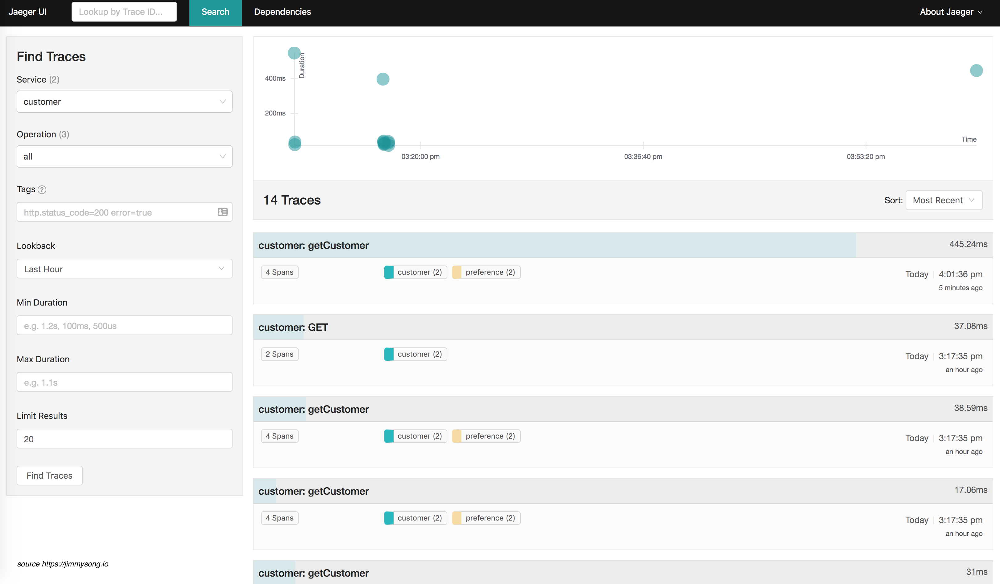
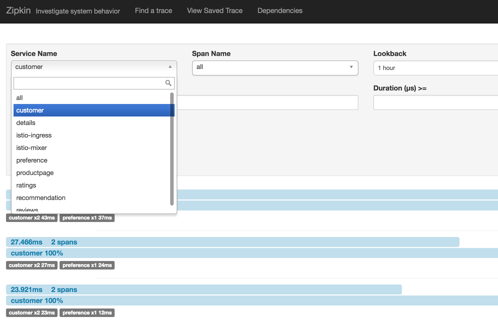
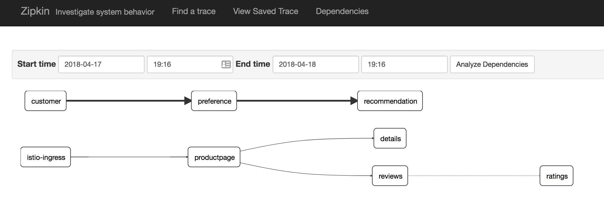
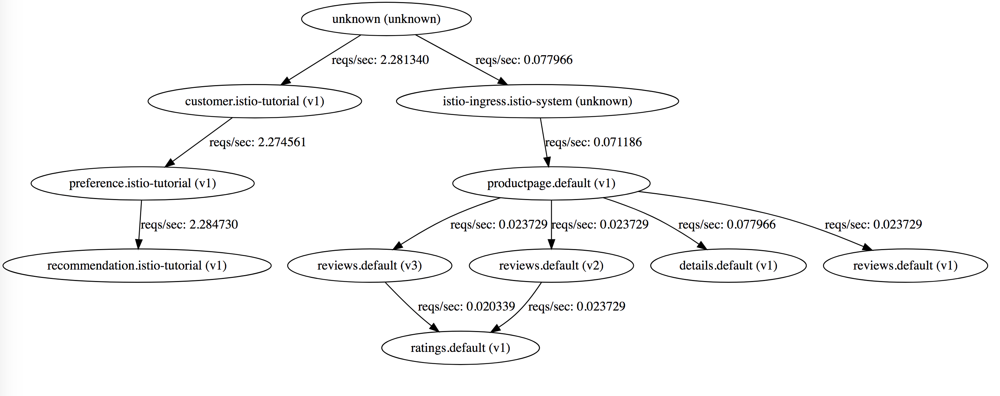
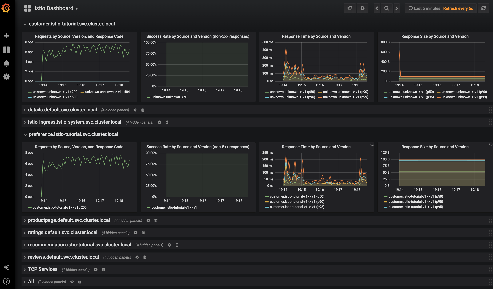

# Istio 教程

**注意：本文档已失效，请浏览 [Istio 官方文档](https://istio.io)。本书中的 Service Mesh 章节已不再维护，请转到 [istio-handbook](https://jimmysong.io/istio-handbook/) 中浏览。**

本文是 Istio 管理 Java 微服务的案例教程，使用的所有工具和软件全部基于开源方案，替换了 [redhat-developer-demos/istio-tutorial](https://github.com/redhat-developer-demos/istio-tutorial) 中的 minishift 环境，使用 [kubernetes-vagrant-centos-cluster](https://github.com/rootsongjc/kubernetes-vagrant-centos-cluster) 替代，沿用了原有的微服务示例，使用 Zipkin 做分布式追踪而不是 Jaeger。

本文中的代码和 YAML 文件见 <https://github.com/rootsongjc/istio-tutorial>。

**注意：本教程基于 Istio 0.7.1，2018年8月1日，Isito 1.0 发布，本教程已过时。**

## 准备环境

在进行本教程前需要先准备以下工具和环境。

- 8G 以上内存
- Vagrant 2.0+
- Virtualbox 5.0 +
- 提前下载 kubernetes1.9.1 的 release 压缩包
- docker 1.12+
- kubectl 1.9.1+
- maven 3.5.2+
- istioctl 0.7.1
- git
- curl、gzip、tar
- [kubetail](https://github.com/johanhaleby/kubetail)
- [siege](https://github.com/JoeDog/siege)

## 安装 Kubernetes

请参考 [kubernetes-vagrant-centos-cluster](https://github.com/rootsongjc/kubernetes-vagrant-centos-cluster) 在本地启动拥有三个节点的 kubernetes 集群。

```bash
git clone https://github.com/rootsongjc/kubernetes-vagrant-centos-cluster.git
cd kubernetes-vagrant-centos-cluster
vagrant up
```

## 安装 Istio

在 [kubernetes-vagrant-centos-cluster](https://github.com/rootsongjc/kubernetes-vagrant-centos-cluster) 中的包含 Istio 0.7.1 的安装 YAML 文件，运行下面的命令安装 Istio。

```bash
kubectl apply -f addon/istio/
```

**运行示例**

```bash
kubectl apply -n default -f <(istioctl kube-inject -f yaml/istio-bookinfo/bookinfo.yaml)
```

在您自己的本地主机的`/etc/hosts`文件中增加如下配置项。

```ini
172.17.8.102 grafana.istio.jimmysong.io
172.17.8.102 servicegraph.istio.jimmysong.io
172.17.8.102 zipkin.istio.jimmysong.io
```

我们可以通过下面的URL地址访问以上的服务。

| Service      | URL                                                          |
| ------------ | ------------------------------------------------------------ |
| grafana      | http://grafana.istio.jimmysong.io                            |
| servicegraph | <http://servicegraph.istio.jimmysong.io/dotviz>，<http://servicegraph.istio.jimmysong.io/graph> |
| zipkin       | http://zipkin.istio.jimmysong.io                             |

详细信息请参阅 https://istio.io/docs/guides/bookinfo.html

## 部署示例应用

在打包成镜像部署到 kubernetes 集群上运行之前，我们先在本地运行所有示例。

本教程中三个服务之间的依赖关系如下：

```ini
customer → preference → recommendation
```

`customer` 和 `preference` 微服务是基于 Spring Boot 构建的，`recommendation` 微服务是基于 [vert.x](https://vertx.io) 构建的。

`customer` 和 `preference` 微服务的 `pom.xml` 文件中都引入了 OpenTracing 和 Jeager 的依赖。

```xml
<dependency>
	<groupId>io.opentracing.contrib</groupId>
	<artifactId>opentracing-spring-cloud-starter</artifactId>
	<version>0.1.7</version>
</dependency>
<dependency>
	<groupId>com.uber.jaeger</groupId>
	<artifactId>jaeger-tracerresolver</artifactId>
    <version>0.25.0</version>
</dependency>
```

### 本地运行

我们首先在本地确定所有的微服务都可以正常运行，然后再打包镜像在 kubernetes 集群上运行。

#### 启动 Jaeger

使用 docker 来运行 jagger。

```bash
docker run -d \
  --rm \
  -p5775:5775/udp \
  -p6831:6831/udp \
  -p6832:6832/udp \
  -p16686:16686 \
  -p14268:14268 \
  jaegertracing/all-in-one:1.3
```

Jaeger UI 地址 http://localhost:16686

#### Customer

```bash
cd customer/java/springboot
JAEGER_SERVICE_NAME=customer mvn \
  spring-boot:run \
  -Drun.arguments="--spring.config.location=src/main/resources/application-local.properties"
```

服务访问地址： http://localhost:8280

#### Preference

```bash
cd preference/java/springboot
JAEGER_SERVICE_NAME=preference mvn \
  spring-boot:run \
  -Drun.arguments="--spring.config.location=src/main/resources/application-local.properties"
```

服务访问地址：http://localhost:8180

#### Recommendation

```bash
cd recommendation/java/vertx
mvn vertx:run
```

服务访问地址：http://localhost:8080

所有服务都启动之后，此时访问 http://localhost:8280 将会看到如下输出。

```bash
customer => preference => recommendation v1 from 'unknown': 1
```

每访问一次最后的数字就会加 1。

#### Jaeger

此时访问 http://localhost:16686 将看到 Jaeger query UI，所有应用将 metrics 发送到 Jeager 中。

可以在 Jaeger UI 中搜索 `customer` 和 `preference` service 的 trace 并查看每次请求的 tracing。



### 构建镜像

在本地运行测试无误之后就可以构建镜像了。本教程中的容器镜像都是在 [fabric8/java-jboss-openjdk8-jdk](https://hub.docker.com/r/fabric8/java-jboss-openjdk8-jdk/~/dockerfile/) 的基础上构建的。只要将 Java 应用构建出 Jar 包然后放到 `/deployments` 目录下基础镜像就可以自动帮我们运行，所以我们看到着几个应用的 `Dockerfile` 文件中都没有执行入口，真正的执行入口是 [run-java.sh](https://github.com/fabric8io-images/java/blob/master/images/jboss/openjdk8/jdk/run-java.sh)。

#### Customer

构建 Customer 镜像。

```bash
cd customer/java/springboot
mvn clean package
docker build -t jimmysong/istio-tutorial-customer:v1 .
docker push jimmysong/istio-tutorial-customer:v1
```

第一次构建和上传需要花费一点时间，下一次构建就会很快。

#### Preference

构建 Preference 镜像。

```bash
cd preference/java/springboot
mvn clean package
docker build -t jimmysong/istio-tutorial-preference:v1 .
docker push jimmysong/istio-tutorial-preference:v1
```

#### Recommendation

构建 Recommendation 镜像。

```bash
cd recommendation/java/vertx
mvn clean package
docker build -t jimmysong/istio-tutorial-recommendation:v1 .
docker push jimmysong/istio-tutorial-recommendation:v1
```

现在三个 docker 镜像都构建完成了，我们检查一下。

```bash
$ docker images | grep istio-tutorial
REPOSITORY                                TAG                 IMAGE ID            CREATED             SIZE
jimmysong/istio-tutorial-recommendation   v1                  d31dd858c300        51 seconds ago      443MB
jimmysong/istio-tutorial-preference       v1                  e5f0be361477        6 minutes ago       459MB
jimmysong/istio-tutorial-customer         v1                  d9601692673e        13 minutes ago      459MB
```

### 部署到 Kubernetes

使用下面的命令将以上服务部署到 kubernetes。

```bash
# create new namespace
kubectl create ns istio-tutorial

# deploy recommendation
kubectl apply -f <(istioctl kube-inject -f recommendation/kubernetes/Deployment.yml) -n istio-tutorial
kubectl apply -f recommendation/kubernetes/Service.yml

# deploy preferrence
kubectl apply -f <(istioctl kube-inject -f preference/kubernetes/Deployment.yml) -n istio-tutorial
kubectl apply -f preference/kubernetes/Service.yml

# deploy customer
kubectl apply -f <(istioctl kube-inject -f customer/kubernetes/Deployment.yml) -n istio-tutorial
kubectl apply -f customer/kubernetes/Service.yml
```

**注意：**`preference` 和 `customer` 应用启动速度比较慢，我们将 livenessProb 配置中的 `initialDelaySeconds` 设置为 **20** 秒。

查看 Pod 启动状态：

```bash
kubectl get pod -w -n istio-tutorial
```

### 增加 Ingress 配置

为了在 kubernetes 集群外部访问 customer 服务，我们需要增加 ingress 配置。

```bash
kubectl apply -f ingress/ingress.yaml
```

修改本地的 `/etc/hosts` 文件，增加一条配置。

```ini
172.17.8.102 customer.istio-tutorial.jimmysong.io
```

现在访问 http://customer.istio-tutorial.jimmysong.io 将看到如下输出：

```ini
customer => preference => recommendation v1 from '6fc97476f8-m2ntp': 1
```

批量访问该地址。

```bash
./bin/poll_customer.sh
```

访问 <http://servicegraph.istio.jimmysong.io/dotviz> 查看服务的分布式追踪和依赖关系。





访问 <http://servicegraph.istio.jimmysong.io/dotviz> 查看服务间的关系图和 QPS。



访问 <http://grafana.istio.jimmysong.io> 查看 Service Mesh 的监控信息。



## Istio 使用示例

为了试用 Istio 中的各种功能，我们需要为应用构建多个版本，我们为 recommendation 构建 v2 版本的镜像，看看如何使用 Istio 控制微服务的流量。

### 构建 recommendation:v2

我们将构建新版的 `recommendation` 服务的镜像，并观察 `customer` 对不同版本的 `recommendataion` 服务的访问频率。

修改 `recommendation/java/vertx/src/main/java/com/redhat/developer/demos/recommendation/RecommendationVerticle.java` 程序中代码。

将 `private static final String RESPONSE_STRING_FORMAT = "recommendation v1 from '%s': %d\n";` 修改为 `private static final String RESPONSE_STRING_FORMAT = "recommendation v2 from '%s': %d\n";`

并构建 `recommendation:v2` 镜像。

```bash
cd recommendation/java/vertx
mvn clean package
docker build -t jimmysong/istio-tutorial-recommendation:v2 .
docker push jimmysong/istio-tutorial-recommendation:v2
```

将应用部署到 kubernetes。

```bash
# deploy recommendation
kubectl apply -f <(istioctl kube-inject -f recommendation/kubernetes/Deployment-v2.yml) -n istio-tutorial
```

现在再访问 `customer` 服务，将看到如下输出：

```bash
$ bin/poll_customer.sh
customer => preference => recommendation v2 from '77b9f6cc68-5xs27': 1
customer => preference => recommendation v1 from '6fc97476f8-m2ntp': 3581
customer => preference => recommendation v2 from '77b9f6cc68-5xs27': 2
customer => preference => recommendation v1 from '6fc97476f8-m2ntp': 3582
customer => preference => recommendation v2 from '77b9f6cc68-5xs27': 3
customer => preference => recommendation v1 from '6fc97476f8-m2ntp': 3583
customer => preference => recommendation v2 from '77b9f6cc68-5xs27': 4
```

我们可以看到 v1 和 v2 版本的 `recommendation` 服务会被间隔访问到。

我们再将 v2 版本的 `recommendation` 实例数设置成 2 个。

```bash
kubectl scale --replicas=2 deployment/recommendation-v2 -n istio-tutorial
kubectl get pod -w -n istio-tutorial
```

观察 `recommendation-v2` Pod 达到两个之后再访问 `customer` 服务。

```bash
$ bin/poll_customer.sh
customer => preference => recommendation v2 from '77b9f6cc68-j9fgj': 1
customer => preference => recommendation v2 from '77b9f6cc68-5xs27': 71
customer => preference => recommendation v1 from '6fc97476f8-m2ntp': 3651
customer => preference => recommendation v2 from '77b9f6cc68-j9fgj': 2
customer => preference => recommendation v2 from '77b9f6cc68-5xs27': 72
customer => preference => recommendation v1 from '6fc97476f8-m2ntp': 3652
customer => preference => recommendation v2 from '77b9f6cc68-j9fgj': 3
customer => preference => recommendation v2 from '77b9f6cc68-5xs27': 73
customer => preference => recommendation v1 from '6fc97476f8-m2ntp': 3653
```

观察输出中 v1 和 v2 版本 `recommendation` 的访问频率。

将 `recommendataion` 服务的实例数恢复为 1。

```bash
kubectl scale --replicas=1 deployment/recommendation-v2
```

### 修改 Istio RouteRules

以下所有路有规则都是针对 `recommendation` 服务，并在 repo 的根目录下执行。

**将所有流量打给 v2**

下面将演示如何动态的划分不同版本服务间的流量，将所有的流量都打到 `recommendation:v2`。

```bash
istioctl create -f istiofiles/route-rule-recommendation-v2.yml -n istio-tutorial
```

现在再访问 `customer` 服务将看到所有的流量都会打到 `recommendation:v2`。

删除 RouteRules 后再访问 `customer` 服务将看到又恢复了 v1 和 v2 版本的 `recommendation` 服务的间隔访问。

```bash
istioctl delete routerule recommendation-default
```

**切分流量**

将 90% 的流量给 v1，10% 的流量给 v2。

```bash
istioctl create -f istiofiles/route-rule-recommendation-v1_and_v2.yml -n istio-tutorial
```

执行`bin/poll_customer.sh` 观察访问情况。

要想动态切分流量只要修改 RouteRules 中的 `weight` 配置即可。

```yaml
apiVersion: config.istio.io/v1alpha2
kind: RouteRule
metadata:
  name: recommendation-v1-v2
spec:
  destination:
    namespace: istio-tutorial
    name: recommendation
  precedence: 5
  route:
  - labels:
      version: v1
    weight: 90
  - labels:
      version: v2
    weight: 10
```

因为 RouteRule 有优先级，为了继续后面的实验，在验证完成后删除该 RouteRule。

```bash
istioctl delete routerule recommendation-v1-v2 -n istio-tutorial
```

### 故障注入

有时候我们为了增强系统的健壮性，需要对系统做混沌工程，故意注入故障，并保障服务可以自动处理这些故障。

**注入 HTTP 503 错误**

```bash
istioctl create -f istiofiles/route-rule-recommendation-503.yml -n istio-tutorial
```

有 50% 的几率报 503 错误。

```bash
$ bin/poll_customer.sh
customer => preference => recommendation v2 from '77b9f6cc68-5xs27': 135
customer => 503 preference => 503 fault filter abort
customer => preference => recommendation v1 from '6fc97476f8-m2ntp': 3860
customer => 503 preference => 503 fault filter abort
customer => 503 preference => 503 fault filter abort
customer => preference => recommendation v2 from '77b9f6cc68-5xs27': 136
customer => preference => recommendation v1 from '6fc97476f8-m2ntp': 3861
customer => 503 preference => 503 fault filter abort
customer => 503 preference => 503 fault filter abort
customer => preference => recommendation v2 from '77b9f6cc68-5xs27': 137
customer => 503 preference => 503 fault filter abort
```

清理 RouteRule。

```bash
istioctl delete routerule recommendation-503 -n istio-tutorial
```

### 增加延迟

增加服务的访问延迟。

```bash
istioctl create -f istiofiles/route-rule-recommendation-delay.yml -n istio-tutorial
```

会有 50% 的几率访问 `recommendation` 服务有 7 秒的延迟。百分比和延迟时间可以在 RouteRule 中配置。

清理 RouteRule。

```bash
istioctl delete routerule recommendation-delay -n istio-tutorial
```

### 重试

让服务不是直接失败，而是增加重试机制。

我们下面将同时应用两条 RouteRule，让访问 `recommendation` 服务时有 50% 的几率出现 503 错误，并在出现错误的时候尝试访问 v2 版本，超时时间为 2 秒。

```bash
istioctl create -f istiofiles/route-rule-recommendation-v2_503.yml -n istio-tutorial
istioctl create -f istiofiles/route-rule-recommendation-v2_retry.yml -n istio-tutorial
```

执行 `bin/poll_customer.sh` 我们看到一开始有些 503 错误，然后所有的流量都流向了 v2。

清理 RouteRules。

```bash
istioctl delete routerule recommendation-v2-retry -n istio-tutorial
istioctl delete routerule recommendation-v2-503 -n istio-tutorial
```

### 超时

设置超时时间，只有服务访问超时才认定服务访问失败。

取消注释 `recommendation/java/vertx/src/main/java/com/redhat/developer/demos/recommendation/RecommendationVerticle.java` 中的下面一行，增加超时时间为 3 秒。

```java
router.get("/").handler(this::timeout);
```

重新生成镜像。

```bash
cd recommendation/java/vertx
mvn clean package
docker build -t jimmysong/istio-tutorial-recommendation:v2 .
docker push jimmysong/istio-tutorial-recommendation:v2
```

重新部署到 kubernetes。

```bash
kubectl delete -f recommendation/kubernetes/Deployment-v2.yml
```

因为我们重新构建的镜像使用了同样的名字和 tag，而之前在 `Deployment-v2.yml` 中配置的镜像拉取策略是 `IfNotPresent`，这样的话即使我们构建了新的镜像也无法应用到集群上，因此将镜像拉取策略改成 `Always` 确保每次启动 Pod 的时候都会拉取镜像。

```bash
kubectl apply -f <(istioctl kube-inject -f recommendation/kubernetes/Deployment-v2.yml) -n istio-tutorial
```

启用超时 RouteRules。

```bash
istioctl create -f istiofiles/route-rule-recommendation-timeout.yml -n istio-tutorial
```

访问 `customer` 服务将看到如下输出：

```bash
$ bin/poll_customer.sh
customer => 503 preference => 504 upstream request timeout
customer => preference => recommendation v1 from '6fc97476f8-m2ntp': 4002
customer => 503 preference => 504 upstream request timeout
customer => preference => recommendation v1 from '6fc97476f8-m2ntp': 4003
customer => 503 preference => 504 upstream request timeout
customer => preference => recommendation v1 from '6fc97476f8-m2ntp': 4004
```

清理 RouteRules。

```bash
istioctl delete routerule recommendation-timeout -n istio-tutorial
```

### 基于 user-agent 的智能路由（金丝雀发布）

User-agent 是一个字符串，其中包含了浏览器的信息，访问 https://www.whoishostingthis.com/tools/user-agent 获取你的 user-agent。

我的 user-agent 是：

```ini
Mozilla/5.0 (Macintosh; Intel Mac OS X 10_13_4) AppleWebKit/537.36 (KHTML, like Gecko) Chrome/65.0.3325.181 Safari/537.36
```

将所有的流量打到 v1。

```bash
istioctl create -f istiofiles/route-rule-recommendation-v1.yml -n istio-tutorial
```

将使用 Safari 浏览器访问的流量打到 v2。

```bash
istioctl create -f istiofiles/route-rule-safari-recommendation-v2.yml -n istio-tutorial
```

谁用 Safari 或者 Chrome（Chrome 浏览器的 user-agent 中也包含 Safari 字段）访问 <http://customer.istio-tutorial.jimmysong.io/> 在经过 3 秒钟（我们在前面重新编译 v2 镜像，设置了 3 秒超时时间）后将看到访问 v2 的输出。

或者使用 curl 访问。

```bash
curl -A Safari http://customer.istio-tutorial.jimmysong.io/
curl -A Firefox http://customer.istio-tutorial.jimmysong.io/
```

观察返回的结果。

将移动端用户的流量导到 v2。

```bash
istioctl create -f istiofiles/route-rule-mobile-recommendation-v2.yml -n istio-tutorial

curl -A "Mozilla/5.0 (iPhone; U; CPU iPhone OS 4(KHTML, like Gecko) Version/5.0.2 Mobile/8J2 Safari/6533.18.5" http://customer.istio-tutorial.jimmysong.io/
```

观察输出的结果。

清理 RouteRules。

```bash
istioctl delete routerule recommendation-mobile -n istio-tutorial
istioctl delete routerule recommendation-safari -n istio-tutorial
istioctl delete routerule recommendation-default -n istio-tutorial
```

### 镜像流量

确保当前至少运行了两个版本的 `recommendation` 服务，并且没有 RouteRule。

注：可以使用 `istioctl get routerule` 获取 RouteRule。

设置流量镜像，将所有 v1 的流量都被镜像到 v2。

```bash
istioctl create -f istiofiles/route-rule-recommendation-v1-mirror-v2.yml -n istio-tutorial
bin/poll_customer.sh
```

查看 recommendation-v2 的日志。

```bash
kubectl logs -f `oc get pods|grep recommendation-v2|awk '{ print $1 }'` -c recommendation
```

### 访问控制

Istio 可以设置服务访问的黑白名单，如果没有权限的话会返回 HTTP 404 Not Found。

#### 白名单

```bash
istioctl create -f istiofiles/acl-whitelist.yml -n istio-tutorial
```

此时访问 `customer` 服务。

```bash
$ bin/poll_customer.sh
customer => 404 NOT_FOUND:preferencewhitelist.listchecker.istio-tutorial:customer is not whitelisted
```

重置环境。

```bash
istioctl delete -f istiofiles/acl-whitelist.yml -n istio-tutorial
```

#### 黑名单

设置黑名单，所有位于黑名单中的流量将获得 403 Forbidden 返回码。

```bash
istioctl create -f istiofiles/acl-blacklist.yml -n istio-tutorial
```

此时访问 `customer` 服务。

```bash
$ bin/poll_customer.sh
customer => 403 PERMISSION_DENIED:denycustomerhandler.denier.istio-tutorial:Not allowed
```

重置环境。

```bash
istioctl delete -f istiofiles/acl-blacklist.yml -n istio-tutorial
```

### 负载均衡

Kubernetes 中默认的负载均衡策略是 round-robin，当然我们可以使用 Istio 把它修改成 random。

增加 v1 的实例数。

```bash
kubectl scale deployment recommendation-v1 --replicas=2 -n istio-tutorial
```

持续访问 `customer` 服务。

```bash
bin/poll_customer.sh
```

保持前台输出，观察流量的行为。

应用负载均衡策略。

```bash
istioctl create -f istiofiles/recommendation_lb_policy_app.yml -n istio-tutorial
```

观察一段时间流量的行为后，重置环境。

```bash
istioctl delete -f istiofiles/recommendation_lb_policy_app.yml -n istio-tutorial
kubectl scale deployment recommendation-v1 --replicas=1 -n istio-tutorial
```

### 速率限制

暂时不可用

### 断路器

当达到最大连接数和最大挂起请求数时快速失败。

将流量在 v1 和 v2 之间均分。

```bash
istioctl create -f istiofiles/route-rule-recommendation-v1_and_v2_50_50.yml -n istio-tutorial
```

未开启断路器的时候启动负载测试。

```bash
$ siege -r 2 -c 20 -v customer.istio-tutorial.jimmysong.io
New configuration template added to /Users/jimmysong/.siege
Run siege -C to view the current settings in that file
** SIEGE 4.0.4
** Preparing 20 concurrent users for battle.
The server is now under siege...
HTTP/1.1 200     0.10 secs:      75 bytes ==> GET  /
HTTP/1.1 200     0.12 secs:      75 bytes ==> GET  /
HTTP/1.1 200     0.13 secs:      75 bytes ==> GET  /
HTTP/1.1 200     0.13 secs:      75 bytes ==> GET  /
HTTP/1.1 200     0.13 secs:      75 bytes ==> GET  /
HTTP/1.1 200     0.17 secs:      75 bytes ==> GET  /
HTTP/1.1 200     3.12 secs:      74 bytes ==> GET  /
HTTP/1.1 200     3.14 secs:      75 bytes ==> GET  /
HTTP/1.1 200     3.15 secs:      74 bytes ==> GET  /
HTTP/1.1 200     3.15 secs:      74 bytes ==> GET  /
HTTP/1.1 200     3.17 secs:      75 bytes ==> GET  /
HTTP/1.1 200     3.17 secs:      75 bytes ==> GET  /
HTTP/1.1 200     3.20 secs:      75 bytes ==> GET  /
HTTP/1.1 200     3.20 secs:      74 bytes ==> GET  /
HTTP/1.1 200     0.05 secs:      75 bytes ==> GET  /
HTTP/1.1 200     0.12 secs:      75 bytes ==> GET  /
HTTP/1.1 200     3.15 secs:      75 bytes ==> GET  /
HTTP/1.1 200     3.25 secs:      75 bytes ==> GET  /
HTTP/1.1 200     3.26 secs:      75 bytes ==> GET  /
HTTP/1.1 200     3.14 secs:      75 bytes ==> GET  /
HTTP/1.1 200     3.58 secs:      74 bytes ==> GET  /
HTTP/1.1 200     6.15 secs:      74 bytes ==> GET  /
HTTP/1.1 200     6.16 secs:      75 bytes ==> GET  /
HTTP/1.1 200     3.03 secs:      74 bytes ==> GET  /
HTTP/1.1 200     6.06 secs:      75 bytes ==> GET  /
HTTP/1.1 200     6.04 secs:      75 bytes ==> GET  /
HTTP/1.1 200     3.11 secs:      74 bytes ==> GET  /
HTTP/1.1 200     3.09 secs:      75 bytes ==> GET  /
HTTP/1.1 200     6.15 secs:      74 bytes ==> GET  /
HTTP/1.1 200     6.71 secs:      74 bytes ==> GET  /
HTTP/1.1 200     3.52 secs:      75 bytes ==> GET  /
^C
Lifting the server siege...
Transactions:		          31 hits
Availability:		      100.00 %
Elapsed time:		        7.99 secs
Data transferred:	        0.00 MB
Response time:		        2.99 secs
Transaction rate:	        3.88 trans/sec
Throughput:		        0.00 MB/sec
Concurrency:		       11.60
Successful transactions:          31
Failed transactions:	           0
Longest transaction:	        6.71
Shortest transaction:	        0.05
```

所有的请求都成功了，但是性能很差，因为 v2 版本设置了 3 秒的超时时间。

我们启用下断路器。

```bash
istioctl create -f istiofiles/recommendation_cb_policy_version_v2.yml -n istio-tutorial
```

重新测试一下。

```bash
$ siege -r 2 -c 20 -v customer.istio-tutorial.jimmysong.io
** SIEGE 4.0.4
** Preparing 20 concurrent users for battle.
The server is now under siege...
HTTP/1.1 200     0.07 secs:      75 bytes ==> GET  /
HTTP/1.1 503     0.07 secs:      92 bytes ==> GET  /
HTTP/1.1 200     0.07 secs:      75 bytes ==> GET  /
HTTP/1.1 503     0.12 secs:      92 bytes ==> GET  /
HTTP/1.1 503     0.12 secs:      92 bytes ==> GET  /
HTTP/1.1 200     0.16 secs:      75 bytes ==> GET  /
HTTP/1.1 503     0.16 secs:      92 bytes ==> GET  /
HTTP/1.1 503     0.21 secs:      92 bytes ==> GET  /
HTTP/1.1 503     0.21 secs:      92 bytes ==> GET  /
HTTP/1.1 200     0.24 secs:      75 bytes ==> GET  /
HTTP/1.1 200     0.24 secs:      75 bytes ==> GET  /
HTTP/1.1 503     0.14 secs:      92 bytes ==> GET  /
HTTP/1.1 503     0.29 secs:      92 bytes ==> GET  /
HTTP/1.1 503     0.13 secs:      92 bytes ==> GET  /
HTTP/1.1 503     0.18 secs:      92 bytes ==> GET  /
HTTP/1.1 503     0.13 secs:      92 bytes ==> GET  /
HTTP/1.1 200     0.11 secs:      75 bytes ==> GET  /
HTTP/1.1 200     0.39 secs:      75 bytes ==> GET  /
HTTP/1.1 200     0.24 secs:      75 bytes ==> GET  /
HTTP/1.1 503     0.44 secs:      92 bytes ==> GET  /
HTTP/1.1 200     0.43 secs:      75 bytes ==> GET  /
HTTP/1.1 200     0.44 secs:      75 bytes ==> GET  /
HTTP/1.1 503     0.40 secs:      92 bytes ==> GET  /
HTTP/1.1 200     0.47 secs:      75 bytes ==> GET  /
HTTP/1.1 503     0.42 secs:      92 bytes ==> GET  /
HTTP/1.1 200     0.42 secs:      75 bytes ==> GET  /
HTTP/1.1 200     0.06 secs:      75 bytes ==> GET  /
HTTP/1.1 503     0.07 secs:      92 bytes ==> GET  /
HTTP/1.1 200     0.15 secs:      75 bytes ==> GET  /
HTTP/1.1 200     0.12 secs:      75 bytes ==> GET  /
HTTP/1.1 503     0.57 secs:      92 bytes ==> GET  /
HTTP/1.1 503     0.18 secs:      92 bytes ==> GET  /
HTTP/1.1 503     0.52 secs:      92 bytes ==> GET  /
HTTP/1.1 503     0.65 secs:      92 bytes ==> GET  /
HTTP/1.1 503     0.42 secs:      92 bytes ==> GET  /
HTTP/1.1 200     0.09 secs:      75 bytes ==> GET  /
HTTP/1.1 200     0.43 secs:      75 bytes ==> GET  /
HTTP/1.1 503     0.04 secs:      92 bytes ==> GET  /
HTTP/1.1 200     4.15 secs:      74 bytes ==> GET  /
HTTP/1.1 200     0.01 secs:      75 bytes ==> GET  /

Transactions:		          19 hits
Availability:		       47.50 %
Elapsed time:		        4.16 secs
Data transferred:	        0.00 MB
Response time:		        0.72 secs
Transaction rate:	        4.57 trans/sec
Throughput:		        0.00 MB/sec
Concurrency:		        3.31
Successful transactions:          19
Failed transactions:	          21
Longest transaction:	        4.15
Shortest transaction:	        0.01
```

我们可以看到在启用了断路器后各项性能都有提高。

清理配置。

```bash
istioctl delete routerule recommendation-v1-v2 -n istio-tutorial
istioctl delete -f istiofiles/recommendation_cb_policy_version_v2.yml -n istio-tutorial
```

### Pool Ejection

所谓的 Pool Ejection 就是当某些实例出现错误（如返回 5xx 错误码）临时将该实例弹出一段时间后（窗口期，可配置），然后再将其加入到负载均衡池中。我们的例子中配置的窗口期是 15 秒。

将 v1 和 v2 的流量均分。

```bash
istioctl create -f istiofiles/route-rule-recommendation-v1_and_v2_50_50.yml -n istio-tutorial
```

增加 v2 的实例个数。

```bash
kubectl scale deployment recommendation-v2 --replicas=2 -n istio-tutorial
kubectl get pods -w
```

等待所有的 Pod 的状态都启动完成。

现在到 v2 的容器中操作。

```bash
$ kubectl exec recommendation-v2-785465d9cd-225ms -c recommendation /bin/bash
$ curl localhost:8080/misbehave
Following requests to '/' will return a 503
```

增加 Pool Ejection 配置。

```bash
istioctl create -f istiofiles/recommendation_cb_policy_pool_ejection.yml -n istio-tutorial
```

此时再访问 `customer` 服务。

```bash
$ bin/poll_customer.sh
customer => preference => recommendation v1 from '6fc97476f8-m2ntp': 10505
customer => preference => recommendation v2 from '785465d9cd-225ms': 2407
customer => preference => recommendation v1 from '6fc97476f8-m2ntp': 10506
customer => preference => recommendation v2 from '785465d9cd-225ms': 2408
customer => preference => recommendation v1 from '6fc97476f8-m2ntp': 10507
customer => preference => recommendation v1 from '6fc97476f8-m2ntp': 10508
customer => preference => recommendation v1 from '6fc97476f8-m2ntp': 10509
customer => 503 preference => 503 recommendation misbehavior from '785465d9cd-ldc6j'
customer => preference => recommendation v2 from '785465d9cd-225ms': 2409
customer => preference => recommendation v2 from '785465d9cd-225ms': 2410
```

我们看到窗口期生效了，当出现 503 错误后至少 15 秒后才会出现第二次。

即使有了负载均衡池弹出策略对于系统的弹性来说依然还不够，如果你的服务有多个可用实例，可以将**断路器**、**重试**、**Pool Ejection** 等策略组合起来使用。

例如在以上的 Pool Ejection 的基础上增加重试策略。

```bash
istioctl replace -f istiofiles/route-rule-recommendation-v1_and_v2_retry.yml -n istio-tutorial
```

现在再访问 `customer` 服务就看不到 503 错误了。

清理配置。

```bash
kubectl scale deployment recommendation-v2 --replicas=1 -n istio-tutorial
istioctl delete routerule recommendation-v1-v2 -n istio-tutorial
istioctl delete -f istiofiles/recommendation_cb_policy_pool_ejection.yml -n istio-tutorial
```

### Egress

Egress 是用来配置 Istio serivce mesh 中的服务对外部服务的访问策略。

具体配置请参考控制 Egress 流量。

以下示例还有问题，无法正常工作。

构建示例镜像 egresshttpbin。

```bash
cd egress/egresshttpbin/
mvn clean package
docker build -t jimmysong/istio-tutorial-egresshttpbin:v1 .
docker push jimmysong/istio-tutorial-egresshttpbin:v1
```

部署到 Kubernetes。

```bash
kubectl apply -f <(istioctl kube-inject -f egress/egresshttpbin/src/main/kubernetes/Deployment.yml) -n istio-toturial
kubectl create -f egress/egresshttpbin/src/main/kubernetes/Service.yml
```

为了在 kubernetes 集群外部访问到该服务，修改增加 ingress 配置并修改本地的`/etc/hosts` 文件，我们在前面已经完成了，此处不再赘述。

构建示例镜像 egressgithub。

```bash
cd egress/egressgithub
mvn clean package
docker build -t jimmysong/istio-tutorial-egressgithub:v1 .
docker push jimmysong/istio-tutorial-egressgithub:v1
```

部署到 Kubernetes。

```bash
kubectl apply -f <(istioctl kube-inject -f egress/egressgithub/src/main/kubernetes/Deployment.yml) -n istio-tutorial
kubectl create -f egress/egressgithub/src/main/kubernetes/Service.yml
```

增加 Egress 配置。

```bash
istioctl create -f istiofiles/egress_httpbin.yml -n istio-tutorial
```

到 egresshttpbin 容器中测试。

```bash
kubectl exec -it $(oc get pods -o jsonpath="{.items[*].metadata.name}" -l app=egresshttpbin,version=v1) -c egresshttpbin /bin/bash

curl localhost:8080

curl httpbin.org/user-agent

curl httpbin.org/headers

exit
```

增加对 [jimmysong.io](https://jimmysong.io) 的 egress 配置。

```bash
cat <<EOF | istioctl create -f -
apiVersion: config.istio.io/v1alpha2
kind: EgressRule
metadata:
  name: jimmysong-egress-rule
  namespace: istio-tutorial
spec:
  destination:
    service: jimmysong.io
  ports:
    - port: 443
      protocol: https
EOF
```

增加 Egress 配置。

```bash
istioctl create -f istiofiles/egress_github.yml -n istio-tutorial
```

到 egressgithub 容器中测试。

```bash
kubectl exec -it $(oc get pods -o jsonpath="{.items[*].metadata.name}" -l app=egressgithub,version=v1) -c egressgithub /bin/bash

curl http://jimmysong:443

exit
```

清理环境。

```bash
istioctl delete egressrule httpbin-egress-rule jimmysong-egress-rule github-egress-rule -n istio-tutorial
```

## 参考

- https://github.com/redhat-developer-demos/istio-tutorial
- [Book - Introducing Istio Service Mesh for Microservices](https://developers.redhat.com/books/introducing-istio-service-mesh-microservices/)
