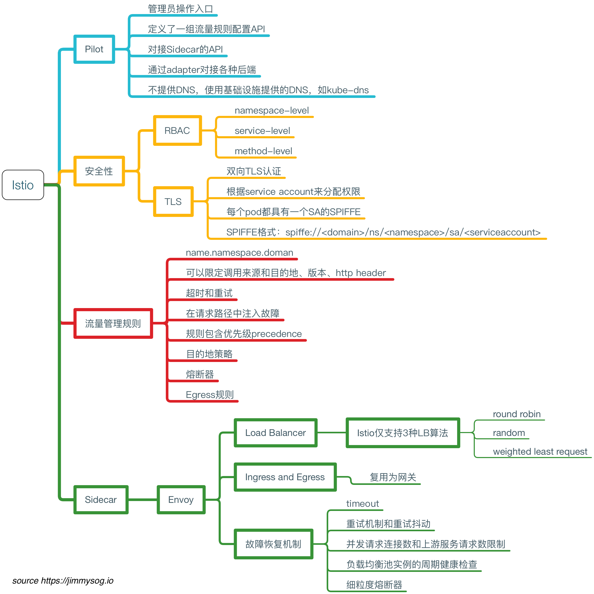
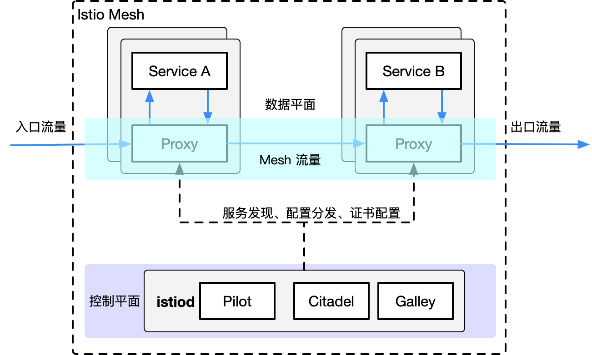

# Istio

[Istio](https://istio.io) 是由 Google、IBM 和 Lyft 开源的微服务管理、保护和监控框架。Istio 为希腊语，意思是”起航“。

关于Istio中的各个组件和一些关键信息请参考下面的mindmap。

## Istio 名称的来历

stio（ISS-tee-oh）是由 [Tetrate](https://tetrate.io/) 创始人 Varun Talwar 和谷歌首席工程师 Louis Ryan 在 2017 年命名的，当时他们都在谷歌工作。

Istio 在希腊语中是 “sail” 的意思，它（ιστίο）延用了 Kubernetes（在希腊语中是飞行员或舵手的意思）建立的希腊航海主题。Istio 和它的表亲 Istos（ιστός）（意思是桅杆、网）都来自古希腊词根 Istimi（ἵστημι），意思是 “to make stand”。

“为了取名，我们翻阅了三个小时希腊字典”Varun 说，“最终我们两人想到一起去了。帆船的理念不仅在于谁在控制船，而是没有船你哪儿也去不了。“

Varun 回忆说 10 个候选名称最后被缩减到 3 个，但命名 Istio Github 仓库的实际需求要求他们快速做出最终决定。

Istio 的网址是 [istio.io](https://istio.io/)，“io” 的重复是值得商榷。就其本身而言，“io” 有很多[含义](https://en.wikipedia.org/wiki/Io)，包括 ionium（锾元素）的缩写、以古代宙斯的情人命名的木星卫星，以及得名于印度洋的互联网顶级域名。我们也注意到 io 是 Ino（奥德赛中的人名）的另一种拼法，Ino 给了 Odysseus（奥德赛中的人名）一个神奇的面纱，让他在五级海洋风暴中顺利航行。Istio 不正是那件法器吗？

最后说明一下：Istio 并不是首字母缩写，但如果一定要说它代表着什么，也许会是 “I Secure, Then I Observe”（我保护，我观察），或者 "I’m Sexy To Infrastructure Operators."（我对基础设施运营商富有吸引力）。

语言学家 Efthymia Lixourgioti 为 Istio 项目的取名提供了希腊语翻译和词源学的咨询。

## 简介

Istio 解决了开发人员和运维人员所面临的从单体应用向分布式微服务架构转变的挑战。了解它是如何做到这一点的可以让我们更详细地理解 Istio 的服务网格。

术语**服务网格**用来描述组成这些应用程序的微服务网络以及它们之间的交互。随着服务网格的规模和复杂性不断的增长，它将会变得越来越难以理解和管理。它的需求包括服务发现、负载均衡、故障恢复、度量和监控等。服务网格通常还有更复杂的运维需求，比如 A/B 测试、金丝雀发布、速率限制、访问控制和端到端认证。

Istio 提供了对整个服务网格的行为洞察和操作控制的能力，以及一个完整的满足微服务应用各种需求的解决方案。

另外，Istio的前身是IBM开源的Amalgam8，追本溯源，我们来看下它的特性。

### Amalgam8

Amalgam8的网站上说，它是一个**Content-based Routing Fabric for Polyglot Microservices**，简单、强大且开源。

Amalgam8是一款基于内容和版本的路由布局，用于集成多语言异构体微服务。 其control plane API可用于动态编程规则，用于在正在运行的应用程序中跨微服务进行路由和操作请求。

以内容/版本感知方式路由请求的能力简化了DevOps任务，如金丝雀和红/黑发布，A/B Test和系统地测试弹性微服务。

可以使用Amalgam8平台与受欢迎的容器运行时（如Docker，Kubernetes，Marathon / Mesos）或其他云计算提供商（如IBM Bluemix，Google Cloud Platform或Amazon AWS）。

## 特性

使用istio的进行微服务管理有如下特性：

- **流量管理**：控制服务间的流量和API调用流，使调用更可靠，增强不同环境下的网络鲁棒性。
- **可观测性**：了解服务之间的依赖关系和它们之间的性质和流量，提供快速识别定位问题的能力。
- **策略实施**：通过配置mesh而不是以改变代码的方式来控制服务之间的访问策略。
- **服务识别和安全**：提供在mesh里的服务可识别性和安全性保护。

未来将支持多种平台，不论是kubernetes、Mesos、还是云。同时可以集成已有的ACL、日志、监控、配额、审计等。

## 设计目标

几个关键的设计目标形成了 Istio 的架构。这些目标对于使系统能够大规模和高性能地处理服务是至关重要的。

- **透明度最大化**：为了采用 Istio，运维人员或开发人员需要做尽可能少的工作，才能从系统中获得真正的价值。为此，Istio 可以自动将自己注入到服务之间的所有网络路径中。Istio 使用 sidecar 代理来捕获流量，并在可能的情况下，在不更改已部署的应用程序代码的情况下，自动对网络层进行配置，以实现通过这些代理来路由流量。在 Kubernetes 中，代理被注入到pods中，通过编写‘iptables’规则来捕获流量。一旦 sidecar 代理被注入以及流量路由被编程，Istio 就可以协调所有的流量。这个原则也适用于性能。当将 Istio 应用于部署时，运维人员会看到所提供功能的资源成本增加地最小。组件和 API 的设计必须考虑到性能和可伸缩性。
- **可扩展性**：随着运维人员和开发人员越来越依赖于 Istio 提供的功能，系统必须随着他们的需求而增长。当我们继续添加新特性时，最大的需求是扩展策略系统的能力，与其他策略和控制源的集成，以及将关于网格行为的信号传播到其他系统进行分析的能力。策略运行时支持用于接入其他服务的标准扩展机制。此外，它允许扩展其词汇表，允许根据网格生成的新信号执行策略。
- **可移植性**：使用 Istio 的生态系统在许多方面都有所不同。Istio 必须在任何云环境或本地环境中通过最小的努力就能运行起来。将基于 Istio 的服务移植到新环境的任务必须是容易实现的。使用 Istio，您可以操作部署到多个环境中的单个服务。例如，可以在多个云上部署来实现冗余。
- **策略一致性**：将策略应用于服务之间的 API 调用提供了对网格行为的大量控制。然而，将策略应用在区别于 API 层上的资源也同样重要。例如，在机器学习训练任务消耗的 CPU 数量上应用配额比在发起任务的请求调用上应用配额更有用。为此，Istio 使用自己的 API 将策略系统维护为一个独立的服务，而不是将策略系统集成到 sidecar 代理中，从而允许服务根据需要直接与之集成。

## 架构

Istio 服务网格从逻辑上分为数据平面和控制平面。

- **数据平面**由一组智能代理（[Envoy](https://www.envoyproxy.io/)）组成，被部署为 sidecar。
- **控制平面**管理并配置代理来进行流量路由。

下图展示了组成每个平面的不同组件：

Istio 的架构分为控制平面和数据平面。

- **数据平面**：由一组智能代理（Envoy）以 sidecar 模式部署，协调和控制所有服务之间的网络通信。
- **控制平面**：负责管理和配置代理路由流量，以及在运行时执行的政策。

### Envoy

Istio 使用 Envoy 代理的扩展版本，该代理是以 C++ 开发的高性能代理，用于调解服务网格中所有服务的所有入站和出站流量。

Envoy 代理被部署为服务的 sidecar，在逻辑上为服务增加了 Envoy 的许多内置特性，例如:

- 动态服务发现
- 负载均衡
- TLS 终端
- HTTP/2 与 gRPC 代理
- 熔断器
- 健康检查
- 基于百分比流量分割的分阶段发布
- 故障注入
- 丰富的指标

Envoy 在 Pod 中以 sidecar 模式部署。 这允许 Istio 将大量关于流量行为的信号作为属性提取出来，并发送给监控系统以提供有关整个服务网格的行为信息。Sidecar 代理模型还允许你将 Istio 功能添加到现有部署中，无需重新构建或重写代码。

### Pilot

Pilot 为 Envoy sidecar 提供服务发现、用于智能路由的流量管理功能（例如，A/B 测试、金丝雀发布等）以及弹性功能（超时、重试、熔断器等）。

Pilot 将控制流量行为的高级路由规则转换为特定于环境的配置，并在运行时将它们传

### Citadel

Citadel 通过内置的身份和证书管理，可以支持强大的服务间以及最终用户的身份验证。您可以使用 Citadel 来升级服务网格中的未加密流量。使用 Citadel，operator 可以执行基于服务身份的策略，而不是相对不稳定的 3 层或 4 层网络标识。从 0.5 版开始，您可以使用 Istio 的授权特性来控制谁可以访问您的服务。

### Galley

Galley 是 Istio 的配置验证、提取、处理和分发组件。它负责将其余的 Istio 组件与从底层平台（例如 Kubernetes）获取用户配置的细节隔离开来。

## 参考

- [Istio：一个用于微服务间通信的服务网格开源项目 - infoq.cn](https://www.infoq.cn/article/2017/05/istio)
- [Istio 是什么？- istio.io](https://istio.io/docs/concepts/what-is-istio/)
- [Istio 服务网格—— 云原生应用网络构建指南 - jimmysong.io](https://jimmysong.io/istio-handbook/)
