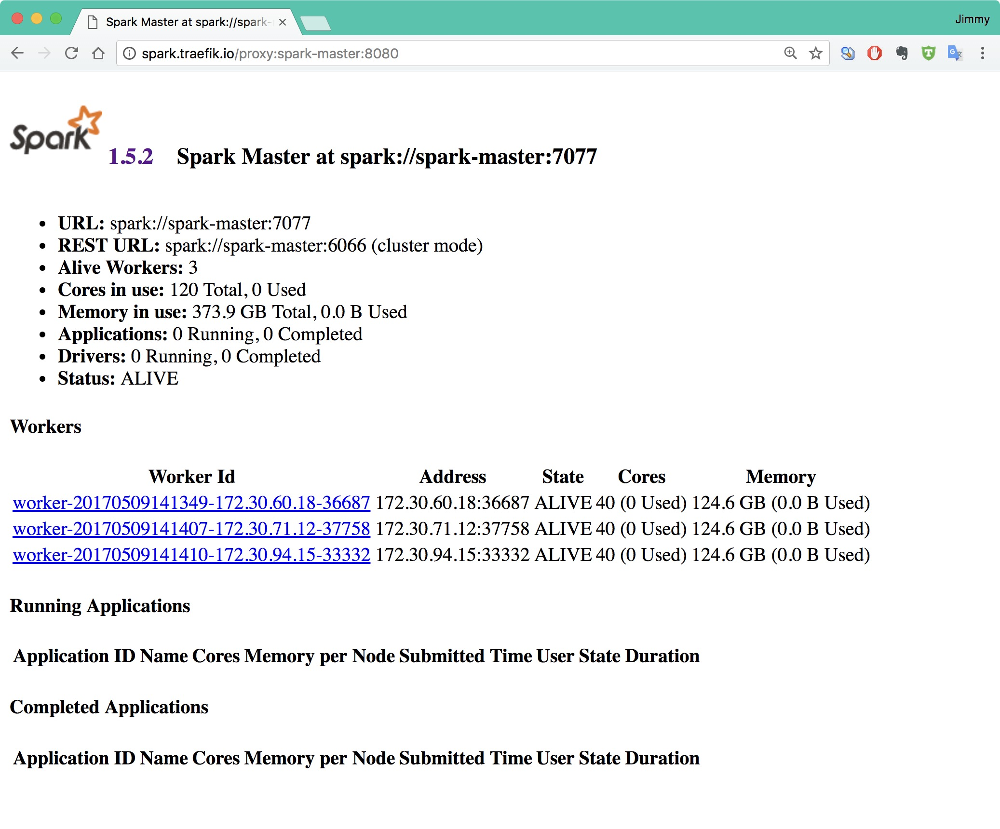
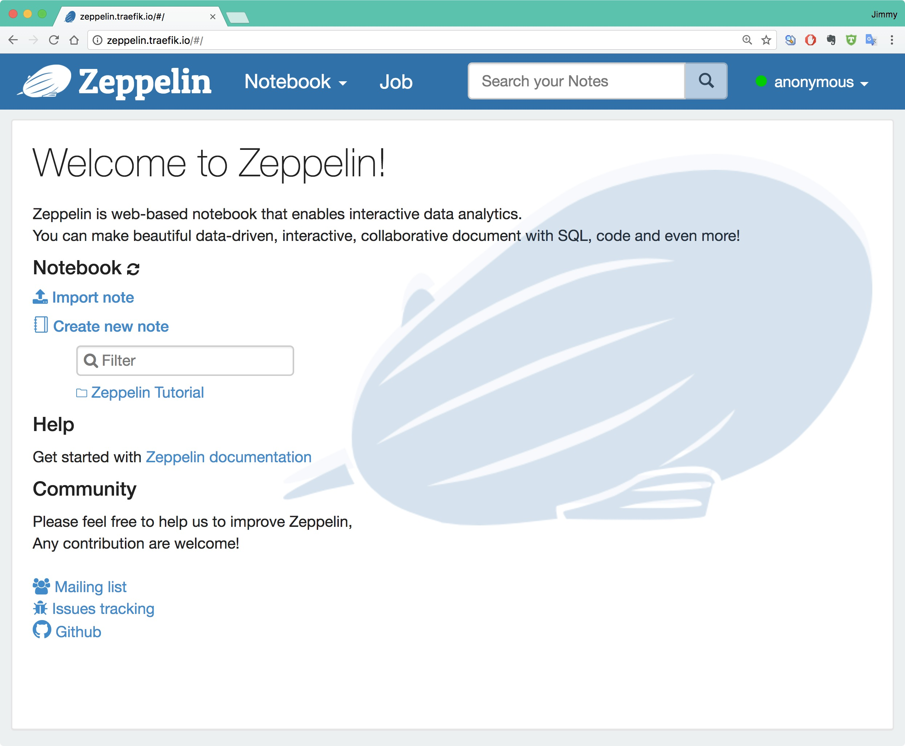

# Spark standalone on Kubernetes

**注：该项目已不推荐使用。**

该项目是基于 Spark standalone 模式，对资源的分配调度还有作业状态查询的功能实在有限，对于让 spark 使用真正原生的 kubernetes 资源调度可以尝试 [apache-spark-on-k8s](https://github.com/apache-spark-on-k8s/)，代码和使用文档见 [spark-on-kubernetes](https://github.com/rootsongjc/spark-on-kubernetes)。

本文中用到的 yaml 文件可以在 `manifests/spark-standalone` 目录下找到，也可以在上面的 [spark-on-kubernetes](https://github.com/rootsongjc/spark-on-kubernetes/) 项目的 manifests 目录下找到。

## 在 Kubernetes 上启动 spark

创建名为 spark-cluster 的 namespace，所有操作都在该 namespace 中进行。

所有 yaml 文件都在 `manifests` 目录下。

```bash
$ kubectl create -f manifests/
```

将会启动一个拥有三个 worker 的 spark 集群和 zeppelin。

同时在该 namespace 中增加 ingress 配置，将 spark 的 UI 和 zeppelin 页面都暴露出来，可以在集群外部访问。

该 ingress 后端使用 traefik。

## 访问 spark

通过上面对 ingress 的配置暴露服务，需要修改本机的 /etc/hosts 文件，增加以下配置，使其能够解析到上述 service。

```ini
172.20.0.119 zeppelin.traefik.io
172.20.0.119 spark.traefik.io
```

172.20.0.119 是我设置的 VIP 地址，VIP 的设置和 traefik 的配置请查看 [kubernetes-handbook](https://github.com/rootsongjc/kubernetes-handbook)。

**Spark UI**

访问 `http://spark.traefik.io`



**Zeppelin UI**

访问 `http://zepellin.treafik.io`


