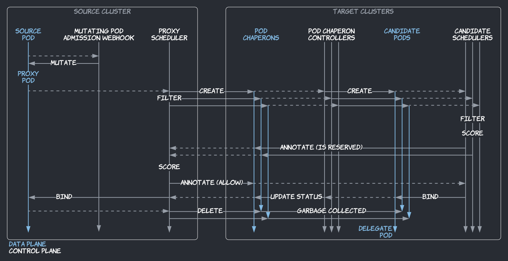

# Admiralty - 基于 Virtual Kubelet 实现的跨集群调度平面

## 前言

目前在车企负责一个包括出车镜像构建、单元测试、仿真、感知评测的通过k8s operator实现的任务流，基于供应链与成本相关的原因，需要加入多架构镜像构建（分别在amd64与arm64的集群上构建出车镜像并通过manifest的方式组织出一个多架构镜像），之前看到了Admiralty可以实现低成本的跨集群任务调度，但是并没有细究其内部实现，于是希望好好学习一番。

## 工作流程

跨集群调度功能需要在命名空间级别启用标签`multiclusterscheduler=enabled`，在pod级别启用标签`multicluster.ammanty.io/elect=""`，在被标记命名空间中含有标签的pod被称为源pod。

跨集群调度的工作通过四个组件共同实现：

> 1.针对变异pod的准入程序
> 
> 2.代理调度器
> 
> 3.伴侣pod控制器
> 
> 4.候选调度器

对于一个给定的变异pod，回调器和代理调度器在源集群运行，伴侣pod控制器和候选调度器在源集群所对应的目标集群中工作。

> 代理和候选调度器使用[Scheduler Framework插件](https://kubernetes.io/docs/concepts/scheduling-eviction/scheduling-framework/)扩展了标准的Kubernetes调度器。因此，它们实现了所有标准的Kubernetes调度功能。

### 代理pod

变异pod准入程序将源pod转换成代理pod:

> 1.原始清单保存为注释，以便过后用于候选pod
> 
> 2.调度约束（节点选择器、关联性、容忍度和拓扑扩展约束）被剥离和替换，以选择和容忍代表目标集群的虚拟节点
> 
> 3.调度方式选择为代理调度器`admiralty-proxy`

代理调度程序把代理pod调度并绑定到代表目标集群的虚拟节点。在代理pod的调度周期中，代理调度器在每个目标集群中(在同一个名称空间中)创建一个候选pod伴侣，并等待该集群中的候选调度器为相应的候选pod预留一个节点，或者不预留。

### 伴侣pod

一种crd（自定义资源），它们像pod一样有spec和status，它们被用作代理pod和候选pod间的中间对象。代理调度器会为了创建候选pod伴侣做以下事情:

> 1.使用源pod的spec（在代理pod中被保存为注释）
>
> 2.调度方式选择为代理调度器`admiralty-candidate`

每个目标集群的pod伴侣控制器使用相同的规范创建一个候选pod。稍后，控制器还会根据候选pod的状态更新pod伴侣的状态和注释。如果候选pod被直接删除(不是因为代理pod被删除) ，例如，如果它被驱逐或抢占，控制器将确保它被替换，即使源集群和目标集群之间的连接被中断。

> 在目标集群中，源集群标识只允许与pod伴侣交互，而不能直接与pod交互，因此它们不能读/写非候选pod。这遵循最小特权原则。

### 候选pod

每个目标集群的候选调度程序将候选pod调度到常规节点。

在候选Pod的调度周期结束时，如果一个节点已经被预留（已经过滤、计分，但还未绑定），在此节点后运行的插件会用`multicluster.admiralty.io/is-reserved=true`对Pod伴侣进行注解。这是为了通知位于源集群中的代理调度器，在其过滤插件等待中，表示目标集群的虚拟节点是代理Pod的潜在匹配项。

如果候选 pod 不可调度，代理调度程序将从pod伴侣的状态(反映候选pod的状态)看到它，并停止等待，拒绝虚拟节点。

在前一种情况下，如果候选pod是可调度的，那么在插件的绑定周期开始时，候选调度程序将等待代理调度程序选择候选pod作为委托pod，委托pod只能有一个。

### 委托pod

如果一个虚拟节点通过了代理调度器的过滤器插件，它仍然必须通过其他标准的Kubernetes过滤器(例如，当它的集群被升级时，虚拟节点是否被封锁?).当多个虚拟节点通过所有过滤器时(更何况，当多个候选节点保留了节点并准备绑定时) ，然后使用标准的Kubernetes函数/插件(例如，扩展与包首选项)对虚拟节点进行计分，最终只有一个虚拟节点被保留给代理节点。然后，代理调度器用`multicluster.admiralty.io/is-allowed=true`注释目标集群中的pod伴侣，通知候选调度器候选pod是委托pod。代理调度程序再次等待，这次是在代理pod的绑定周期开始时，查看是否成功绑定了委托pod。

接下来，候选调度程序绑定委托pod。无论成功还是失败，代理调度程序都可以从pod伴侣的状态看到它。如果成功，则删除所有其他候选pod。如果失败，则将其放回调度队列中。

### 总结

Pod伴侣注释被用作代理调度器和候选调度器之间的双向跨集群通讯通道，以协调调度和绑定周期。当调度一个代理Pod（将其绑定到一个虚拟节点）时，代理调度器对目标集群知之甚少。它不基于聚合数据进行过滤，因为这可能不准确。相反，它将候选Pod发送至所有目标集群。候选调度器拥有确定这些Pod是否可以被调度所需的所有情况。在基于聚合且足够的数据过滤通过的虚拟节点得分之后，代理调度器选出一个候选Pod作为委托Pod。最终，委托Pod被绑定，代理Pod也被绑定，而所有其他的候选Pod则被删除。
